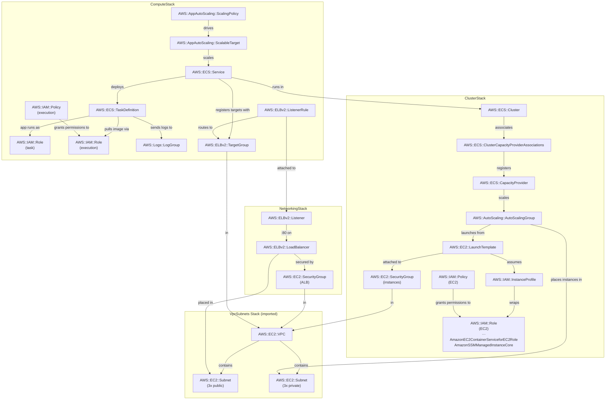

# ecs-ec2-alb

Runs the shared Express API on ECS with EC2 Spot instances (Graviton, bridge networking) behind an Application Load Balancer. Teaches capacity providers, dynamic port mapping, and the 3-role IAM model — concepts absent from the Fargate patterns.

## Pattern Description

```
Client
  │ HTTP GET /ecs-ec2-alb/quote
  ▼
ALB  (internet-facing, public subnets)
  │ Listener :80
  │   ├── /ecs-ec2-alb, /ecs-ec2-alb/*  → Target Group (priority 100)
  │   └── default                        → 404 "Not Found"
  │
  ▼
Target Group  (INSTANCE type, dynamic port)
  │  ECS registers instance-id:ephemeral-port on each task start
  │
  ▼
ECS EC2 Service  (bridge network mode)
  │  ROUTE_PREFIX=/ecs-ec2-alb
  │
  ├── EC2 Spot ASG  (t4g.micro / t4g.small / c7g.medium, ARM64)
  │     └── ECS-optimized AMI  (agent + Docker pre-installed)
  │
  ├── ECR image          (from ElasticContainerRegistryStack)
  └── API_KEY env var    (from SSM SecureString via task definition secrets)
```

- [Application Load Balancer](https://docs.aws.amazon.com/elasticloadbalancing/latest/application/introduction.html) — Layer 7 load balancer with path-based routing; health-checks instances and routes HTTP traffic
- [ECS Capacity Provider](https://docs.aws.amazon.com/AmazonECS/latest/developerguide/cluster-capacity-providers.html) — binds the ASG to the ECS cluster; managed scaling adjusts ASG desired count to match task demand; managed termination protection drains tasks before scale-in
- [EC2 Auto Scaling Group](https://docs.aws.amazon.com/autoscaling/ec2/userguide/auto-scaling-groups.html) — 100% Spot via `PRICE_CAPACITY_OPTIMIZED`; multiple ARM64 instance types for pool diversity; `capacityRebalance` for proactive Spot replacement
- [ECS Bridge Networking](https://docs.aws.amazon.com/AmazonECS/latest/developerguide/task_definition_parameters.html#network_mode) — `hostPort: 0` maps the container port to a random ephemeral port (32768-65535); the ECS agent registers the actual host port with the ALB target group; multiple tasks can run on the same instance
- [ALB Target Group (instance type)](https://docs.aws.amazon.com/elasticloadbalancing/latest/application/load-balancer-target-groups.html) — routes to EC2 instance IDs at the registered dynamic host port; health checks go directly to instance:port

## Cost

Region: eu-central-1 — 1 Spot instance running 24/7, ~10k requests/month

| Resource           | Idle        | ~10k req/month | Cost driver                                |
| ------------------ | ----------- | -------------- | ------------------------------------------ |
| ALB                | ~$16/mo     | ~$16/mo        | $0.008/LCU·hr + $0.028/hr fixed            |
| EC2 Spot t4g.micro | ~$1.50/mo   | ~$1.50/mo      | ~$0.0021/hr Spot (vs $0.0104/hr On-Demand) |
| CloudWatch Logs    | ~$0.50/mo   | ~$0.50/mo      | Ingestion cost                             |
| **Total**          | **~$18/mo** | **~$18/mo**    | ALB fixed cost dominates                   |

~40% cheaper than `ecs-fargate-alb` (~$30/mo) primarily because EC2 Spot replaces Fargate compute. The ALB fixed cost (~$16/mo) still dominates at low traffic.

## Notes

**Bridge mode vs awsvpc**

Bridge mode (`hostPort: 0`) lets multiple tasks share one EC2 instance via dynamic port mapping — no ENI density limit. A `t4g.micro` supports at most 2 ENIs (awsvpc mode = 2 tasks max) but can run many bridge-mode tasks as long as CPU and memory permit. Tradeoff: bridge mode doesn't give each task its own IP or security group — all tasks on the same instance share the instance SG.

**Dedicated cluster**

This pattern deploys its own ECS cluster instead of reusing the shared `EcsClusterStack` (which is Fargate-only). Adding an EC2 capacity provider to the shared cluster would change its blast radius and couple the ASG lifecycle to shared Fargate infrastructure. A dedicated cluster keeps the blast radius isolated.

**Capacity providers and 2-layer auto-scaling**

Two scaling mechanisms work together:

1. **Service auto-scaling** (compute stack): adjusts the ECS service's desired task count based on CPU utilization (target: 50%).
2. **Capacity provider managed scaling** (cluster stack): adjusts the ASG's EC2 instance count to match the total task capacity needed. `targetCapacityPercent: 100` means ECS targets full utilization — no spare instances sit idle.

`enableManagedTerminationProtection: true` prevents the ASG from terminating instances that still have running tasks; ECS drains them first.

**3-role IAM model**

ECS on EC2 uses 3 IAM roles, vs 2 for Fargate and 1 for raw Docker on EC2:

1. **Instance role** — attached to the EC2 instance; used by the ECS agent for `RegisterContainerInstance`, `DiscoverPollEndpoint`, CloudWatch metrics, and ECR pulls. Managed policy: `AmazonEC2ContainerServiceforEC2Role`.
2. **Execution role** — CDK auto-creates this; used by ECS to pull images from ECR and inject SSM secrets at task start. Not visible on the instance.
3. **Task role** — used by the running container to call AWS APIs (none needed here since the app only reads an injected env var).

**ECS secrets vs user data SSM reads**

The Fargate patterns inject secrets via `ecs.Secret.fromSsmParameter`. This pattern uses the same approach — ECS fetches the SSM SecureString at task launch via the execution role. The raw-Docker pattern (`ec2s-behind-alb`) reads SSM in EC2 user data at boot time instead, which bakes the key into the instance and goes stale on rotation. ECS secrets refresh on each new task launch.

**Spot interruption resilience**

`capacityRebalance: true` on the ASG means EC2 proactively replaces instances that receive a Spot rebalance recommendation (before the 2-minute interruption notice). Combined with managed termination protection (ECS drains first) and the service circuit breaker (rolls back on repeated failures), the service recovers automatically from Spot reclaims.

## Commands

**1. Prerequisites — ECR image and SSM API key must exist**

```bash
# See elastic-container-registry README for full steps
npx cdk deploy ElasticContainerRegistryStack
# push image, create SSM parameter...
```

**2. Deploy the stacks**

```bash
# VpcSubnets must be deployed with natGateways >= 1 so instances can pull from ECR
npx cdk deploy -c natGateways=1 VpcSubnets EcsEc2AlbNetworkingStack EcsEc2AlbClusterStack EcsEc2AlbComputeStack
```

**3. Invoke the API**

```bash
# Get ALB endpoint http://<alb-dns>
ENDPOINT=$(aws cloudformation describe-stacks \
  --stack-name EcsEc2AlbNetworkingStack \
  --query "Stacks[0].Outputs[?OutputKey=='AlbEndpoint'].OutputValue" \
  --output text)

# Health check (unauthenticated)
curl "$ENDPOINT/ecs-ec2-alb/health"
# {"status":"ok"}

# Unmatched path returns 404
curl "$ENDPOINT/nonexistent"
# Not Found

# Read the API key from SSM
API_KEY=$(aws ssm get-parameter \
  --name /hands-on-aws/containers/api-key \
  --with-decryption \
  --query "Parameter.Value" \
  --output text)

# Quote with key
curl -H "x-api-key: $API_KEY" "$ENDPOINT/ecs-ec2-alb/quote"
```

**4. Observe logs**

```bash
aws logs tail /ecs/ecs-ec2-alb --follow
```

**5. Destroy**

```bash
npx cdk deploy VpcSubnets -c natGateways=0 # destroy NAT Gateway which drains money
npx cdk destroy EcsEc2AlbComputeStack EcsEc2AlbClusterStack EcsEc2AlbNetworkingStack
```

**6. Capture CloudFormation templates**

```bash
npx cdk synth EcsEc2AlbNetworkingStack > patterns/containers/ecs-ec2-alb/cloud_formation_networking.yaml
npx cdk synth EcsEc2AlbClusterStack > patterns/containers/ecs-ec2-alb/cloud_formation_cluster.yaml
npx cdk synth EcsEc2AlbComputeStack > patterns/containers/ecs-ec2-alb/cloud_formation_compute.yaml
```

## Entity Relation of AWS Resources


