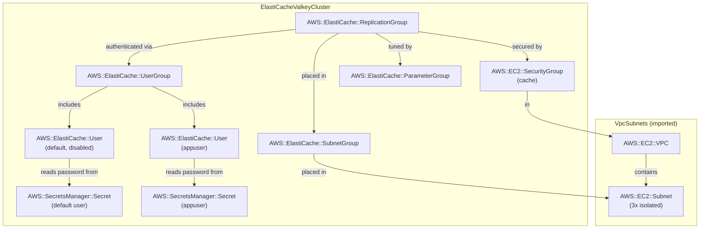

# ElastiCache Valkey (Cluster Mode)

## Pattern Description

```
Client (curl / browser)
  │  HTTP
  ▼
SSM Port-Forward (:3000 → EC2 :3000)
  │  HTTP
  ▼
Demo Server (Express, EC2)
  │  Valkey TLS :6379  →  Config Endpoint (fetches cluster slot map)
  ▼
ElastiCache Cluster (cluster mode, Valkey 8)
  ├── Shard 0 (slots 0–8191):     Primary  →  Replica  (async replication)
  └── Shard 1 (slots 8192–16383): Primary  →  Replica  (async replication)
```

- [Amazon ElastiCache](https://docs.aws.amazon.com/AmazonElastiCache/latest/dg/WhatIs.html) managed cache cluster running [Valkey 8](https://valkey.io/), an open-source Redis-compatible engine
- [Cluster mode](https://docs.aws.amazon.com/AmazonElastiCache/latest/dg/Replication.Redis.Cluster.html): the keyspace (hash slots 0–16383) is distributed across multiple shards, each owned by a primary node
- Horizontal scaling: adding shards distributes key ownership, enabling memory and throughput beyond single-node limits
- Topology controlled via `-c shards=N -c replicas=M` at deploy time:

| `-c shards=` | `-c replicas=` | Topology | Total nodes | Notes |
|---|---|---|---|---|
| `2` (default) | `1` (default) | 2 primaries + 2 replicas | 4 | Multi-AZ HA |
| `3` | `0` | 3 primaries, no replicas | 3 | No HA; not recommended for production |
| `3` | `1` | 3 primaries + 3 replicas | 6 | Production-grade |

- Auth: [RBAC](https://docs.aws.amazon.com/AmazonElastiCache/latest/dg/Clusters.RBAC.html) via `CfnUser` / `CfnUserGroup` — `appuser` has full access; `default` user is disabled
- TLS in transit + encryption at rest
- VPC from [`vpc-subnets`](../vpc-subnets/) stack
- Password stored in [Secrets Manager](https://docs.aws.amazon.com/secretsmanager/latest/userguide/intro.html) (~$0.40/mo)

**Key learning: multi-key commands only work when all keys share the same hash slot.** Use [hash tags](https://redis.io/docs/latest/develop/use/keyspace/#hash-tags) (`{tag}:field`) to co-locate related keys on the same shard. See the `/slot` endpoint for an interactive demo.

## Cost

Region: `eu-central-1`. Assumes 24/7 idle, minimal throughput.

| Resource | Idle | ~1 unit/mo | Cost driver |
|---|---|---|---|
| cache.t4g.micro | ~$12/node/mo | — | Per-node-hour billing |
| EC2 t4g.nano (demo server) | ~$3/mo | — | Instance uptime |
| Secrets Manager | ~$0.40/mo | — | Per-secret fee |
| NAT gateway | $0 | — | None (SSM via public subnet) |

Default config (`shards=2`, `replicas=1`): 4 nodes × $12 = **~$48/mo** in cache alone.

Dominant cost: total node count. Every extra shard + its replicas adds `(1 + replicas) × $12/mo`.

## Notes

- **Cluster vs non-cluster mode**: non-cluster mode ([`elasticache-valkey-active-passive`](../elasticache-valkey-active-passive/)) has one shard owning all 16383 slots. Cluster mode splits slots across `N` shards; each shard independently handles its portion of keys. Use cluster mode when a single node's memory or throughput becomes a bottleneck.
- **Config endpoint**: in cluster mode, Configuration Endpoint replaces the separate Primary + Reader endpoints. It routes initial connections to any cluster node; the client then fetches the full slot map via `CLUSTER SLOTS`.
- **Scaling a Valkey cluster**: `numNodeGroups` (shard count) can be changed online, causing ElastiCache to redistribute will slots across shards without downtime. CloudFormation supports this via the `UseOnlineResharding` update policy.
- Changing the number of replicas (`replicasPerNodeGroup`) requires resource replacement. Scaling replicas means a full destroy + recreate of the replication group.
- **`cluster-allow-reads-when-down: yes`**: allows reads on a shard that has lost contact with a majority of masters. Trades consistency for availability during partitions. Appropriate for a demo cache; for strict consistency, set to `no` (the default), which causes `CLUSTERDOWN` errors on affected shards.
- **`automaticFailoverEnabled` is mandatory for cluster mode**: ElastiCache requires it when `numNodeGroups > 1`. Setting `replicas=0` is allowed but leaves no standby for failover.
- **Multi-key commands and hash tags**: commands like `MSET`, `MGET`, `SMEMBERS` applied across keys on different shards fail with `CROSSSLOT` errors. Solution: prefix related keys with a shared hash tag — `{session}:user`, `{session}:cart` both hash only `session` and land on the same shard. The `/slot` endpoint shows the hash tag in effect.
- **Running inside the VPC**: the demo server runs on a dedicated EC2 in `ElastiCacheValkeyClusterApp`, inside the VPC. It connects directly to all shard IPs via the config endpoint — no SSM tunnels per shard or natMap needed. Running locally would require one SSM tunnel per shard primary plus natMap to translate internal shard IPs to localhost ports.


## Commands

### Deploy

Depends on `VpcSubnets` stack only. Admin access to ElastiCache is available via the demo server EC2 (SSM into it and run `valkey-cli`).

```bash
# Default: 2 shards, 0 replicas/shard = 2 nodes total
npx cdk deploy VpcSubnets ElastiCacheValkeyCluster ElastiCacheValkeyClusterApp -c shards=2 -c replicas=0

# 2 shards, 1 replica/shard = 4 nodes total
npx cdk deploy VpcSubnets ElastiCacheValkeyCluster ElastiCacheValkeyClusterApp -c shards=2 -c replicas=1

# 3 shards, 1 replica each = 6 nodes
npx cdk deploy VpcSubnets ElastiCacheValkeyCluster ElastiCacheValkeyClusterApp -c shards=3 -c replicas=1
```

### Reshard

```bash
# Scale from 2 shards to 3 — online resharding, no downtime
npx cdk deploy ElastiCacheValkeyCluster -c shards=3 -c replicas=0
```

### Run Demo Server

The demo server runs on a dedicated EC2 in the `ElastiCacheValkeyClusterApp` stack. It connects directly to all shard primaries from within the VPC — no SSM tunnels or natMap needed (like local setup). Access it via a single SSM port-forward to port 3000.

```bash
# Fetch instance ID locally
DEMO_SERVER=$(aws cloudformation describe-stacks --stack-name ElastiCacheValkeyClusterApp \
  --query "Stacks[0].Outputs[?OutputKey=='DemoServerInstanceId'].OutputValue" --output text)

# Terminal 1: SSM into the demo server, download the bundle, run it
aws ssm start-session --target "$DEMO_SERVER"
# On the instance (wait ~60s after first deploy for user data to finish):
ASSET_URL=$(aws cloudformation describe-stacks --stack-name ElastiCacheValkeyClusterApp \
  --query "Stacks[0].Outputs[?OutputKey=='DemoServerAssetS3Url'].OutputValue" --output text)
aws s3 cp "$ASSET_URL" /tmp/bundle.zip && unzip -o /tmp/bundle.zip -d /tmp/demo/
AWS_REGION=eu-central-1 node /tmp/demo/demo_server.js

# Terminal 2: Port-forward so you can reach the server from your machine
aws ssm start-session --target "$DEMO_SERVER" \
  --document-name AWS-StartPortForwardingSession \
  --parameters '{"portNumber":["3000"],"localPortNumber":["3000"]}'
```

### Interact

```bash
# Write a key — routed to the shard owning its hash slot
curl "http://localhost:3000/set?key=hello&value=world"
# Response includes the key's hash slot: {"ok":true,"key":"hello","slot":866}

# Read a key
curl "http://localhost:3000/get?key=hello"

# Show which slot and shard a key maps to (educational)
curl "http://localhost:3000/slot?key=hello"
curl "http://localhost:3000/slot?key={session}:user"
curl "http://localhost:3000/slot?key={session}:cart"
# Both {session} keys share the same slot — safe for multi-key commands

# List all keys (scans all shards and merges; never use KEYS in production)
curl "http://localhost:3000/keys"

# Delete a key
curl "http://localhost:3000/del?key=hello"

# Replication info for each master node
curl "http://localhost:3000/info" | jq .
```

### Observe Logs

```bash
# Demo server logs stack outputs, cluster connection events, and each request to stdout
# Visible in the Terminal 1 SSM session where node /tmp/demo/demo_server.js is running
```

### Destroy

```bash
# Destroy in reverse dependency order; keep VpcSubnets if shared with other stacks
npx cdk destroy ElastiCacheValkeyClusterApp ElastiCacheValkeyCluster
```

### Capture CloudFormation YAML

```bash
npx cdk synth ElastiCacheValkeyCluster -c shards=2 -c replicas=1 > patterns/elasticache-valkey-cluster/cloud_formation.yaml
npx cdk synth ElastiCacheValkeyClusterApp -c shards=2 -c replicas=1 > patterns/elasticache-valkey-cluster/cloud_formation_app_stack.yaml
```

## Entity Relation of AWS Resources


