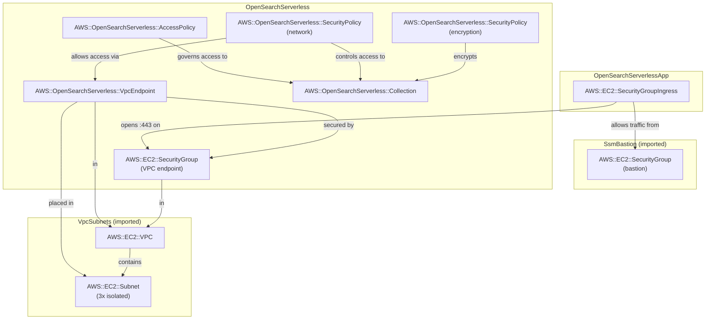

# opensearch-serverless

## Pattern Description

```
Local demo server
      │  HTTP :3000
      ▼
  Express server  ──SigV4──►  OpenSearch Client
                                    │
                              HTTPS to localhost:8443
                                    │
                        ┌───────────▼──────────────┐
                        │  SSM Port-Forward Tunnel  │
                        └───────────┬──────────────┘
                                    │  SSM over HTTPS
                                    ▼
                            EC2 Bastion (SSM)
                                    │  HTTPS :443
                                    ▼
                      AOSS VPC Interface Endpoint
                            (in isolated subnet)
                                    │
                                    ▼
                      OpenSearch Serverless Collection
                          (type: SEARCH, 2 OCUs min)
```

Components:
- **[OpenSearch Serverless](https://docs.aws.amazon.com/opensearch-service/latest/developerguide/serverless.html)** — fully managed OpenSearch with OCU-based billing, no node management. `SEARCH` type is optimised for low-latency, high-concurrency query workloads.
- **[Encryption policy](https://docs.aws.amazon.com/opensearch-service/latest/developerguide/serverless-encryption.html)** — AWS-owned KMS key applied to the collection at rest.
- **[Network policy](https://docs.aws.amazon.com/opensearch-service/latest/developerguide/serverless-network.html)** — restricts access to the VPC endpoint only; no public endpoint is created.
- **[Data access policy](https://docs.aws.amazon.com/opensearch-service/latest/developerguide/serverless-data-access.html)** — IAM-based document-level permissions (collection + index operations) for the deploying account's root.
- **[VPC endpoint](https://docs.aws.amazon.com/opensearch-service/latest/developerguide/serverless-vpc.html)** — interface endpoint (ENI) in isolated subnets; the only ingress path to the collection.
- **[SSM bastion](../ssm-bastion/README.md)** — EC2 instance reachable via Session Manager for port forwarding — no SSH, no inbound rules.
- **[SigV4 signing](https://docs.aws.amazon.com/general/latest/gr/sigv4_signing.html)** — all requests signed with `service: 'aoss'`; no username/password auth for Serverless.

Data flow:
1. Demo server signs each HTTP request with SigV4 (service `aoss`) using local AWS credentials
2. Request is sent to `https://localhost:8443` — the local end of the SSM tunnel
3. SSM forwards it to the AOSS VPC interface endpoint inside the VPC
4. AOSS validates the SigV4 signature against the data access policy and returns the response

## Cost

> Region: eu-central-1. Minimum OCU allocation with `standbyReplicas: DISABLED`.

| Resource | Idle | ~10K docs/month | Cost driver |
|---|---|---|---|
| OpenSearch Serverless (2 OCU min) | **$0.48/hr ≈ $346/mo** | Same | OCU minimum — billed even with zero traffic |
| VPC interface endpoint | ~$7/mo | ~$7/mo | 1 ENI per AZ × hourly rate |
| EC2 bastion (t4g.nano) | ~$3/mo | ~$3/mo | Instance uptime |
| **Total** | **~$356/mo** | **~$356/mo** | OCU minimum dominates |

**Warning**: OCUs are billed continuously regardless of traffic. **Destroy this stack when done.**

`standbyReplicas: ENABLED` doubles the minimum to 4 OCUs (~$0.96/hr, ~$692/mo) but provides HA across AZs.

## Notes

**L1-only constructs**: `aws-cdk-lib/aws-opensearchserverless` only exposes `CfnCollection`, `CfnSecurityPolicy`, `CfnAccessPolicy`, and `CfnVpcEndpoint`. There are no L2 constructs with grant helpers — all IAM-equivalent permissions are expressed as JSON in the data access policy.

**Policy prerequisites**: A collection will not become `ACTIVE` without a matching encryption policy. The network and data access policies must also exist before the collection is usable. `addDependency` enforces the correct CloudFormation creation order.

**SigV4 service name**: Must be `'aoss'`, not `'es'` (which is for managed OpenSearch domains). Using `'es'` results in a 403 with no helpful error message.

**SigV4 + tunnel Host header**: The OpenSearch client connects to `localhost:<tunnelPort>` but must sign requests with the real collection hostname. The Host header is explicitly overridden so the signature matches what AOSS expects. Without this override, AOSS returns 403 SignatureDoesNotMatch.

**Collection creation time**: AOSS collections take 3-5 minutes to reach `ACTIVE` status after CloudFormation completes. The demo server will get connection errors until then.

**standbyReplicas is immutable**: Cannot be changed after creation — must delete and recreate the collection (and all data) to change it.

**No Scroll API**: AOSS does not support Scroll. Use `search_after` with a sort tiebreaker (`_id`) for cursor-based pagination.

**AOSS manages shards and refresh**: Do not set `number_of_shards`, `number_of_replicas`, or `refresh_interval` in index settings — AOSS rejects them with a 400 error.

**OCU cold starts**: After idle, OCUs may scale down. First requests can take 10-30s. `requestTimeout: 60_000` accounts for this.

**429 retry**: The OpenSearch transport does not retry 429s (only 502/503/504). The demo server implements its own exponential backoff + jitter for OCU throttling.

## Commands

### Deploy

```bash
# VpcSubnets and SsmBastion must be deployed first
npx cdk deploy VpcSubnets SsmBastion OpenSearchServerless OpenSearchServerlessApp
```

Wait 3-5 minutes after deployment for the collection to reach `ACTIVE` status.

### SSM Port Forward

[Install the SSM Session Manager plugin](https://docs.aws.amazon.com/systems-manager/latest/userguide/install-plugin-macos-overview.html) if you haven't already.

```bash
# Fetch stack outputs
BASTION=$(aws cloudformation describe-stacks --stack-name SsmBastion \
  --query "Stacks[0].Outputs[?OutputKey=='BastionInstanceId'].OutputValue" --output text)
# Strip https:// — the bastion resolves this hostname inside the VPC,
# where it points to the VPC endpoint ENI via AOSS private DNS.
HOST=$(aws cloudformation describe-stacks --stack-name OpenSearchServerless \
  --query "Stacks[0].Outputs[?OutputKey=='CollectionEndpoint'].OutputValue" --output text \
  | sed 's|https://||')

# Start tunnel — keep this terminal open
aws ssm start-session \
  --target "$BASTION" \
  --document-name AWS-StartPortForwardingSessionToRemoteHost \
  --parameters "{\"host\":[\"${HOST}\"],\"portNumber\":[\"443\"],\"localPortNumber\":[\"8443\"]}"
```

### Run Demo Server

In a new terminal (keep the tunnel running):

```bash
AWS_REGION=eu-central-1 npx ts-node patterns/opensearch-serverless/demo_server.ts
```

### Interact

**Create index** (run once before indexing):
```bash
curl -s -X PUT http://localhost:3000/index | jq
```

**Index a product:**
```bash
curl -s -X POST http://localhost:3000/products \
  -H 'Content-Type: application/json' \
  -d '{"id":"p1","name":"Wireless Headphones","description":"Noise-cancelling over-ear headphones with 30h battery","category":"electronics","price":149.99,"inStock":true}' | jq
```

**Bulk index products:**
```bash
curl -s -X POST http://localhost:3000/products/_bulk \
  -H 'Content-Type: application/json' \
  -d '[
    {"id":"p2","name":"Running Shoes","description":"Lightweight trail running shoes","category":"footwear","price":89.99,"inStock":true},
    {"id":"p3","name":"Coffee Grinder","description":"Burr grinder for espresso and filter coffee","category":"kitchen","price":59.99,"inStock":false},
    {"id":"p4","name":"Mechanical Keyboard","description":"TKL layout, Cherry MX switches","category":"electronics","price":119.99,"inStock":true}
  ]' | jq
```

Wait ~10s for the refresh before searching.

**Full-text search:**
```bash
curl -s "http://localhost:3000/search?q=coffee" | jq
curl -s "http://localhost:3000/search?q=headphones&limit=5" | jq

# Paginate — pass next_search_after from the previous response
curl -s "http://localhost:3000/search?q=&limit=2&search_after=%5B1.0%2C%22p1%22%5D" | jq
```

**Advanced search with filters and aggregations:**
```bash
# Electronics under $130, in stock
curl -s "http://localhost:3000/search/advanced?category=electronics&maxPrice=130&inStock=true" | jq

# Full-text + price range
curl -s "http://localhost:3000/search/advanced?q=grinder&minPrice=40&maxPrice=100" | jq
```

**Get by ID:**
```bash
curl -s http://localhost:3000/products/p1 | jq
```

**Delete a document:**
```bash
curl -s -X DELETE http://localhost:3000/products/p1 | jq
```

**Delete index:**
```bash
curl -s -X DELETE http://localhost:3000/index | jq
```

### Observe

```bash
# Collection status (CREATING → ACTIVE)
aws opensearchserverless batch-get-collection --names search-demo \
  --query 'collectionDetails[0].status' --output text
```

### Synthesize CloudFormation

```bash
npx cdk synth OpenSearchServerless > patterns/opensearch-serverless/cloud_formation.yaml
npx cdk synth OpenSearchServerlessApp > patterns/opensearch-serverless/cloud_formation_app.yaml
```

### Destroy

```bash
npx cdk destroy OpenSearchServerlessApp OpenSearchServerless
```

## Entity Relationship Diagram of AWS Resources


