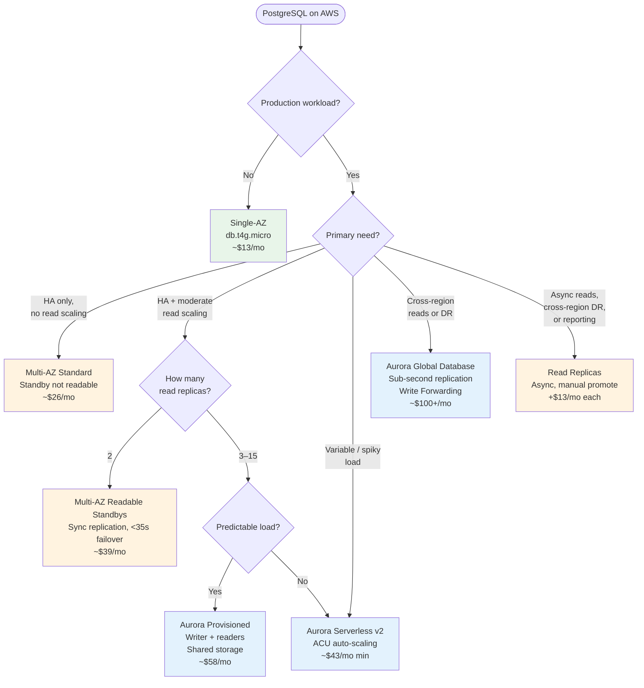

# RDS & Aurora PostgreSQL — Topology Overview

This directory contains CDK patterns for Amazon RDS and Aurora PostgreSQL. Each sub-pattern implements one deployment topology end-to-end with a working demo server.

## Topologies at a Glance

| Topology                                                  | Engine | HA             | Readable Replicas        | Failover                               | CDK Construct                       | Cost (idle, eu-central-1)   |
| --------------------------------------------------------- | ------ | -------------- | ------------------------ | -------------------------------------- | ----------------------------------- | --------------------------- |
| [Single-AZ](#single-az)                                   | RDS    | None           | 0                        | Restore from snapshot (minutes–hours)  | `DatabaseInstance`                  | ~$13/mo (t4g.micro)         |
| [Multi-AZ](#multi-az-standard)                            | RDS    | Auto           | 0 — standby is invisible | 60–120s                                | `DatabaseInstance`                  | ~$26/mo                     |
| [Read Replicas](#read-replicas)                           | RDS    | Manual promote | Up to 15 (async)         | Manual — promote replica to standalone | `DatabaseInstanceReadReplica`       | +$13/mo per replica         |
| [Multi-AZ Readable Standbys](#multi-az-readable-standbys) | RDS    | Auto           | 2 (sync)                 | <35s                                   | `DatabaseCluster`                   | ~$39/mo                     |
| [Aurora Provisioned](#aurora-provisioned)                 | Aurora | Auto           | Up to 15 (zero-lag)      | <30s                                   | `DatabaseCluster`                   | ~$58/mo (writer + 1 reader) |
| [Aurora Serverless v2](#aurora-serverless-v2)             | Aurora | Auto           | Up to 15                 | <30s                                   | `DatabaseCluster` (serverlessV2)    | ~$43/mo (0.5 ACU min)       |
| [Aurora Global Database](#aurora-global-database)         | Aurora | Cross-region   | 16/region × 5 regions    | ~60s cross-region                      | `DatabaseCluster` + `GlobalCluster` | ~$100+/mo                   |

---

## Decision Tree



---

## Topology Details

### Single-AZ

One DB instance in one Availability Zone. No standby, no replication.

```
┌─────────────────────────┐
│       AZ-1              │
│  ┌──────────────────┐   │
│  │  RDS PostgreSQL  │   │
│  │   (read/write)   │   │
│  └──────────────────┘   │
└─────────────────────────┘
```

- **Use case**: Development, testing, PoC. Never production.
- **Failure mode**: AZ outage = downtime until AWS restores the instance or you restore from a snapshot.
- **Taught in**: [`rds-postgres`](./rds-postgres)

---

### Multi-AZ Standard

One primary + one **synchronous** standby in a different AZ. The standby is completely invisible — it accepts no connections and cannot serve reads. AWS manages automatic DNS failover.

```
┌────────────────────────┐    ┌────────────────────────┐
│         AZ-1           │    │         AZ-2           │
│  ┌──────────────────┐  │    │  ┌──────────────────┐  │
│  │  Primary (R/W)   │──┼────┼─▶│ Standby (hidden) │  │
│  └──────────────────┘  │    │  └──────────────────┘  │
└────────────────────────┘    └────────────────────────┘
         ▲
   single endpoint
   (DNS flips on failover)
```

- **Use case**: Production workloads needing HA with no application changes on failover.
- **Failover**: Automatic DNS CNAME flip in 60–120s. Application reconnects to the same hostname.
- **Key misconception**: You pay 2× but get **zero read scaling**. The standby is purely for HA.
- **Taught in**: [`rds-postgres`](./rds-postgres)

---

### Read Replicas

Asynchronous copies of the primary. Each replica has its own endpoint. Replicas can be in the same region, a different region, or even promoted to a standalone instance.

```
                      ┌─────────────────────────────────────┐
                      │  eu-central-1                       │
┌──────────────────┐  │  ┌────────────────┐                 │
│ Primary (R/W)    │──┼─▶│  Read Replica  │ (reporting)     │
└──────────────────┘  │  └────────────────┘                 │
         │            └─────────────────────────────────────┘
         │ async
         ▼
┌──────────────────────────────────────────────────┐
│  us-east-1 (cross-region)                        │
│  ┌────────────────────────────────────────────┐  │
│  │ Read Replica  (can be promoted for DR)     │  │
│  └────────────────────────────────────────────┘  │
└──────────────────────────────────────────────────┘
```

- **Use case**: Offloading heavy read/reporting queries; cross-region DR; gradual regional migration.
- **Replication**: Asynchronous — stale reads possible under heavy write load.
- **DR promote**: Promoting a replica breaks replication and creates a new standalone instance. No automatic failover.
- **Chaining**: Replicas can replicate from other replicas (up to 5 hops), useful for fan-out.
- **Taught in**: [`rds-read-replicas`](./rds-read-replicas)

---

### Multi-AZ Readable Standbys

One primary + **two readable standbys** across three AZs. Standbys use synchronous replication (transaction committed to at least one standby before acknowledgment) and can serve read traffic via a reader endpoint. Generally Available since 2023.

```
┌──────────────┐   ┌──────────────┐   ┌──────────────┐
│    AZ-1      │   │    AZ-2      │   │    AZ-3      │
│  ┌────────┐  │   │  ┌────────┐  │   │  ┌────────┐  │
│  │Primary │──┼──▶│  │Standby │  │   │  │Standby │  │
│  │ (R/W)  │  │   │  │ (R/O)  │  │   │  │ (R/O)  │  │
│  │        │──┼───┼──┼────────┼──┼──▶│  │        │  │
│  └────────┘  │   │  └────────┘  │   │  └────────┘  │
└──────────────┘   └──────────────┘   └──────────────┘
     (EBS)               (EBS)               (EBS)
       ▲                                      ▲
 writer endpoint                       reader endpoint
                                    (load-balanced across standbys)
```

- **Use case**: Production workloads that need HA + read offloading without moving to Aurora.
- **Failover**: <35s — two standby candidates; no EBS reattach needed.
- **vs Aurora**: Same 3-AZ layout, but RDS storage model (EBS-backed). Aurora wins on replica count (15 vs 2) and failover speed (<30s vs <35s), but at higher cost.
- **CDK note**: Uses `DatabaseCluster`, not `DatabaseInstance` — different L2 construct.
- **Taught in**: [`rds-readable-standbys`](./rds-readable-standbys)

---

### Aurora Provisioned

Aurora separates storage from compute. All instances share a single **distributed storage layer** (6 copies across 3 AZs, auto-grows to 128 TB). The writer and all readers see the same data with zero replication lag on reads.

```
┌─────────────────────────────────────────────────────┐
│                   Aurora Cluster                    │
│                                                     │
│  ┌──────────┐  ┌──────────┐  ┌──────────┐          │
│  │  Writer  │  │ Reader 1 │  │ Reader 2 │  ...×15  │
│  │  (R/W)   │  │  (R/O)   │  │  (R/O)   │          │
│  └────┬─────┘  └────┬─────┘  └────┬─────┘          │
│       │              │              │                │
│  ┌────▼──────────────▼──────────────▼────────────┐  │
│  │        Shared Distributed Storage              │  │
│  │   (6 copies × 3 AZs, auto-grows to 128 TB)   │  │
│  └────────────────────────────────────────────────┘  │
└─────────────────────────────────────────────────────┘
         ▲                    ▲
   writer endpoint      reader endpoint
                     (custom endpoints for
                      workload isolation)
```

- **Use case**: High-throughput production workloads needing up to 15 read replicas and faster failover than standard RDS.
- **Failover**: <30s — no EBS reattach; a reader is promoted to writer on the existing storage.
- **Storage billing**: Per GB-month + per I/O request (no IOPS provisioning, no EBS management).
- **Custom endpoints**: You can create endpoint groups (e.g., one for OLTP readers, one for analytics) pointing to specific reader subsets.
- **Taught in**: [`rds-aurora-provisioned`](./rds-aurora-provisioned)

---

### Aurora Serverless v2

Aurora instances that auto-scale in 0.5 ACU increments. 1 ACU ≈ 2 GB RAM + proportional CPU. You set a min/max ACU range per instance. Writer and readers can each be serverless or provisioned — mix and match within one cluster.

```
┌─────────────────────────────────────────────────────────┐
│                   Aurora Cluster                        │
│                                                         │
│  ┌──────────────────┐    ┌──────────────────┐           │
│  │  Writer          │    │  Reader          │           │
│  │  Serverless v2   │    │  Serverless v2   │           │
│  │  0.5–32 ACU      │    │  0.5–32 ACU      │           │
│  │  (auto-scales)   │    │  (auto-scales)   │           │
│  └────────┬─────────┘    └────────┬─────────┘           │
│           │                       │                     │
│  ┌────────▼───────────────────────▼─────────────────┐   │
│  │              Shared Distributed Storage           │   │
│  └───────────────────────────────────────────────────┘   │
└─────────────────────────────────────────────────────────┘
```

- **Use case**: Variable/unpredictable workloads; dev environments that should scale to near-zero; mixing a serverless reader (cheap) with a provisioned writer (stable latency).
- **Billing**: Per ACU-hour (~$0.12/ACU-hour in eu-central-1). Minimum ACU setting determines your floor cost.
- **vs Aurora Provisioned**: Same storage model. Serverless v2 adds elastic compute at the cost of slightly less predictable latency at scale-up edges.
- **Taught in**: [`rds-aurora-serverless-v2`](./rds-aurora-serverless-v2)

---

### Aurora Global Database

One **primary** Aurora cluster (read-write) + up to 5 **secondary** clusters in different regions. Storage is replicated cross-region with typical lag <1 second. Secondary regions can serve reads locally. **Write Forwarding** allows secondary regions to accept write traffic and transparently forward it to the primary.

```
┌─────────────────────────────────┐      ┌──────────────────────────────────┐
│  eu-central-1 (Primary)         │      │  us-east-1 (Secondary)           │
│  ┌──────────┐  ┌──────────┐     │      │  ┌──────────┐  ┌──────────┐      │
│  │  Writer  │  │ Readers  │     │      │  │ Readers  │  │ Readers  │      │
│  │  (R/W)   │  │ (up to   │     │      │  │ (up to   │  │   ...    │      │
│  └────┬─────┘  │   15)    │     │      │  │   16)    │  └──────────┘      │
│       │        └──────────┘     │      │  └────┬─────┘                    │
│  ┌────▼──────────────────────┐  │      │  ┌────▼──────────────────────┐   │
│  │   Aurora Storage          │──┼─────▶│  │ Replicated Storage        │   │
│  │   (source of truth)       │  │ <1s  │  │ (read-only, local copy)   │   │
│  └───────────────────────────┘  │      │  └───────────────────────────┘   │
└─────────────────────────────────┘      └──────────────────────────────────┘
                                                        │ Write Forwarding
                                              writes forwarded to primary
```

- **Use case**: Global applications needing low-latency reads per region; RPO < 1s cross-region DR; regulatory data locality requirements.
- **Write Forwarding**: Secondary clusters can accept writes locally. Aurora forwards them to the primary automatically — the application does not need to know which region is the writer.
- **Managed failover**: Promote a secondary to primary in ~1 minute (planned switchover) or with some RPO risk (unplanned).
- **Cost**: Highest — two or more full Aurora clusters + cross-region data transfer fees.
- **Taught in**: [`rds-aurora-global`](./rds-aurora-global)

---

## Cost Comparison

Approximate idle cost in `eu-central-1`, 24/7, smallest viable instance size:

```
Single-AZ (t4g.micro)         ████░░░░░░░░░░░░░░░░░░░░░   ~$13/mo
Multi-AZ Standard (t4g.micro) ████████░░░░░░░░░░░░░░░░░   ~$26/mo
Readable Standbys (t4g.micro) ████████████░░░░░░░░░░░░░   ~$39/mo
Aurora Serverless v2 (0.5ACU) ██████████████░░░░░░░░░░░   ~$43/mo
Aurora Provisioned (t4g.med.) █████████████████░░░░░░░░   ~$58/mo
Aurora Global (2 regions)     ████████████████████████░   ~$120+/mo
```

Read replicas add ~$13/mo each (t4g.micro) on top of any topology above.

---

## Key Distinctions

**1. Multi-AZ standby is NOT readable.**
Standard Multi-AZ gives you a hot standby you can never query. You pay 2× for zero read scaling. The 2023 Readable Standbys topology fixes this — standbys are synchronous AND queryable.

**2. Aurora storage is fundamentally different from RDS.**
RDS uses EBS volumes attached to an instance. Aurora uses a shared distributed storage layer across all instances. This is why Aurora failover is faster (no EBS reattach), why readers have zero replication lag (they read from the same storage), and why storage auto-grows without pre-allocation.

**3. `DatabaseInstance` vs `DatabaseCluster` in CDK.**
`DatabaseInstance` = standard RDS (Single-AZ, Multi-AZ Standard, source for read replicas).
`DatabaseCluster` = Aurora AND Multi-AZ Readable Standbys. These are different CloudFormation resource types with different endpoint models.

**4. Read replica replication is asynchronous.**
Under heavy write load, replicas can fall behind. A read after a write may return stale data if it hits a replica. Aurora readers do not have this problem — they read from shared storage, so they see committed writes immediately.

**5. RDS Proxy decouples connection count from instance count.**
Lambda functions open a new DB connection per invocation. 500 concurrent Lambdas = 500 connections. `max_connections` on a `db.t4g.small` is ~90. RDS Proxy pools connections at the proxy layer, so the DB sees far fewer actual connections regardless of Lambda concurrency.

**6. Aurora Write Forwarding is not multi-master.**
Secondary regions accept writes and forward them to the primary over the replication channel. There is still one authoritative writer. Forwarded writes have higher latency (cross-region round-trip) and some restrictions (no DDL, no XA transactions). True multi-master is not available for Aurora PostgreSQL.

---

## Sub-Patterns

| Pattern                                                  | Topology                                  | Status  |
| -------------------------------------------------------- | ----------------------------------------- | ------- |
| [`rds-postgres`](./rds-postgres)                         | Single-AZ + Multi-AZ + RDS Proxy          | Done    |
| [`rds-read-replicas`](./rds-read-replicas)               | Async read replicas, cross-region DR      | Done    |
| [`rds-readable-standbys`](./rds-readable-standbys)       | Multi-AZ with 2 readable standbys         | Done    |
| [`rds-aurora-provisioned`](./rds-aurora-provisioned)     | Aurora writer + readers, custom endpoints | Done    |
| [`rds-aurora-serverless-v2`](./rds-aurora-serverless-v2) | Aurora Serverless v2 ACU autoscaling      | planned |
| [`rds-aurora-global`](./rds-aurora-global)               | Aurora Global Database + Write Forwarding | planned |
