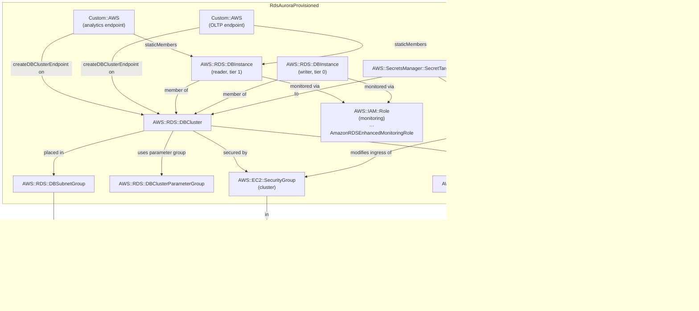

# rds-aurora-provisioned

## Pattern Description

```
Demo Server
    |
    | HTTP (localhost:3000)
    v
 Express App
    |
    |-- RW pool --> localhost:5432 --SSM tunnel--> Bastion EC2
    |-- RO pool --> localhost:5433 --SSM tunnel--> Bastion EC2
                                                       |
                                          Aurora Cluster (eu-central-1)
                                          +-----------------------------+
                                          |  Shared Storage Layer       |
                                          |  (6-way replicated SSD)     |
                                          +-----------------------------+
                                               |              |
                                          [Writer]       [Reader1]
                                          t4g.medium     t4g.medium
                                               |              |
                                    Writer Endpoint   Reader Endpoint
                                                      OLTP Custom EP
                                                      Analytics Custom EP
```

**Components:**

- **[Aurora PostgreSQL](https://docs.aws.amazon.com/AmazonRDS/latest/AuroraUserGuide/Aurora.AuroraPostgreSQL.html)** — managed PostgreSQL-compatible database with a distributed [shared storage architecture](https://docs.aws.amazon.com/AmazonRDS/latest/AuroraUserGuide/Aurora.Overview.StorageReliability.html). Storage is replicated 6 ways across 3 AZs without application involvement.
- **Writer instance** — the single authoritative write endpoint. Always up-to-date; failover promotes a reader in <30s without EBS reattach.
- **Reader instance** — shares the same cluster volume as the writer. The writer streams WALs to readers asynchronously; readers apply them to their buffer cache. [Replica lag is typically <100ms](https://docs.aws.amazon.com/AmazonRDS/latest/AuroraUserGuide/Aurora.Replication.html) under normal load — much lower than standard async replicas (seconds), but not zero.
- **[Custom endpoints (free)](https://docs.aws.amazon.com/AmazonRDS/latest/AuroraUserGuide/Aurora.Overview.Endpoints.html#Aurora.Endpoints.Custom)** — static member groups for workload-specific routing. OLTP endpoint and OLAP endpoint target customisable set of readers tailored to workload requirements
- **[AWS Secrets Manager](https://docs.aws.amazon.com/secretsmanager/latest/userguide/intro.html)** — auto-rotated credentials; the secret contains `{username, password}`.
- **[Performance Insights](https://docs.aws.amazon.com/AmazonRDS/latest/AuroraUserGuide/USER_PerfInsights.html)** — query-level load analysis; 7-day retention included free.
- **[Enhanced Monitoring](https://docs.aws.amazon.com/AmazonRDS/latest/AuroraUserGuide/USER_Monitoring.OS.html)** — 60s OS-level metrics (CPU steal, file system I/O).

---

## Cost

Region: `eu-central-1` | Workload: idle, standard storage

| Resource                 | Idle         | ~100 writes/s           | Cost driver                               |
| ------------------------ | ------------ | ----------------------- | ----------------------------------------- |
| Writer (`db.t4g.medium`) | ~$29/mo      | ~$29/mo                 | Instance hours                            |
| Reader (`db.t4g.medium`) | ~$29/mo      | ~$29/mo                 | Instance hours                            |
| Storage (`aurora`)       | ~$0.10/GB-mo | ~$0.10/GB-mo            | GB stored × 6-way replication billed as 1 |
| I/O                      | $0 idle      | ~$0.20/million requests | Aurora I/O requests                       |
| Performance Insights     | $0           | $0                      | 7-day retention is free                   |
| Enhanced Monitoring      | ~$0.01/mo    | ~$0.01/mo               | CloudWatch custom metrics                 |
| Secrets Manager          | ~$0.40/mo    | ~$0.40/mo               | 1 secret + rotation calls                 |
| Custom endpoints         | $0           | $0                      | Free; pay only for instances behind them  |

**I/O Optimized threshold:** Switch `storageType` to `AURORA_IOPT1` ($0.225/GB-month, no per-I/O charge) when I/O charges exceed ~25% of total Aurora spend. At that crossover, flat-rate I/O Optimized is cheaper than per-request billing.

---

## Notes

**Aurora vs RDS storage model.** Standard RDS writes to a single EBS volume per instance. Replication copies the entire write stream to replica instances. Aurora separates compute from storage: all instances access a shared distributed storage layer. There is no EBS reattach on failover — the new primary picks up exactly where the old one left off, yielding <30s failover vs ~60–120s for standard RDS Multi-AZ.

**Replication lag.** Aurora readers receive the writer's WAL stream asynchronously and apply it to their own buffer cache — they do not read live storage pages from the writer. AWS documents typical lag as [usually less than 100ms](https://docs.aws.amazon.com/AmazonRDS/latest/AuroraUserGuide/Aurora.Replication.html), but it increases under heavy write load or on under-provisioned reader instances. Reads immediately after a write can return stale data. This is much lower than standard async read replicas (seconds of lag), but not zero — do not assume read-your-writes consistency on the reader endpoint.

**Custom endpoints.** Custom endpoints let you add reader instances for specific workload classes (OLTP, analytics, reporting) without changing application connection strings. The endpoint DNS is stable; membership is changed in the CloudFormation/API layer. Both custom endpoints here share the same reader — demonstrating the feature without the cost of additional instances.

**Parameter tuning rationale.**

- `random_page_cost=1.1`: Aurora's storage has near-uniform SSD latency. PostgreSQL's default of 4.0 (modeled on spinning-disk seek overhead) under-values index scans and causes the planner to prefer sequential scans. 1.1 reflects actual Aurora I/O cost.
- `shared_preload_libraries=pg_stat_statements,auto_explain`: `pg_stat_statements` exposes query-level execution stats via `pg_stat_statements` view. `auto_explain` logs slow query plans automatically without needing `EXPLAIN ANALYZE` manually.
- Autovacuum scale factors: default 10%/5% triggers vacuum only when 10% of a table's rows are dead — which is too late for large tables. 5%/2% runs more frequently and keeps bloat under control.

**CloudWatch Logs export.** `cloudwatchLogsExports: ['postgresql']` streams the PostgreSQL log to CloudWatch Logs. Paired with `log_min_duration_statement=1000`, this gives a searchable slow-query log without any agent.

**No RDS Proxy.** Proxy is used in `rds-postgres` and `rds-read-replicas`. Aurora's <30s failover is fast enough for most workloads. Add a proxy when connection counts approach `max_connections` on the instance class or when Lambda cold-start connection storms are a concern.

---

## Commands to play with stack

**Deploy:**

```bash
npx cdk deploy SsmBastion RdsAuroraProvisioned
```

**Start SSM tunnels** (two terminals):

```bash
# Terminal 1 — writer endpoint (port 5432)
BASTION=$(aws cloudformation describe-stacks --stack-name SsmBastion \
  --query "Stacks[0].Outputs[?OutputKey=='BastionInstanceId'].OutputValue" --output text)

WRITER=$(aws cloudformation describe-stacks --stack-name RdsAuroraProvisioned \
  --query "Stacks[0].Outputs[?OutputKey=='WriterEndpoint'].OutputValue" --output text)
aws ssm start-session --target $BASTION \
  --document-name AWS-StartPortForwardingSessionToRemoteHost \
  --parameters "{\"host\":[\"$WRITER\"],\"portNumber\":[\"5432\"],\"localPortNumber\":[\"5432\"]}"

# Terminal 2 — reader endpoint (port 5433)
READER=$(aws cloudformation describe-stacks --stack-name RdsAuroraProvisioned \
  --query "Stacks[0].Outputs[?OutputKey=='ReaderEndpoint'].OutputValue" --output text)
aws ssm start-session --target $BASTION \
  --document-name AWS-StartPortForwardingSessionToRemoteHost \
  --parameters "{\"host\":[\"$READER\"],\"portNumber\":[\"5432\"],\"localPortNumber\":[\"5433\"]}"
```

**Start demo server:**

```bash
AWS_REGION=eu-central-1 npx ts-node patterns/rds/demo_server.ts rds-aurora-provisioned
```

**Interact:**

```bash
# Write a quote (via writer endpoint)
curl -s -X POST localhost:3000/quotes \
  -H 'Content-Type: application/json' \
  -d '{"text":"The shared storage layer is Aurora'\''s key innovation.","author":"AWS"}' | jq

# Read quotes (via reader endpoint — <100ms lag under normal load)
curl -s localhost:3000/quotes | jq

# Write-read test — checks replication lag (replicated may be false if read too quickly after write)
curl -s localhost:3000/write-read-test | jq

# Health check — shows both pool stats
curl -s localhost:3000/health | jq
```

**Observe logs:**

```bash
LOG_GROUP=$(aws logs describe-log-groups \
  --log-group-name-prefix /aws/rds/cluster \
  --query "logGroups[*].logGroupName" --output text)
aws logs filter-log-events \
  --log-group-name "$LOG_GROUP" \
  --filter-pattern "duration" \
  --query "events[*].message" --output text
```

**Destroy:**

```bash
npx cdk destroy SsmBastion RdsAuroraProvisioned
```

**Capture CloudFormation template:**

```bash
npx cdk synth RdsAuroraProvisioned > patterns/rds/rds-aurora-provisioned/cloud_formation.yaml
```

## Entity Relation of AWS Resources


