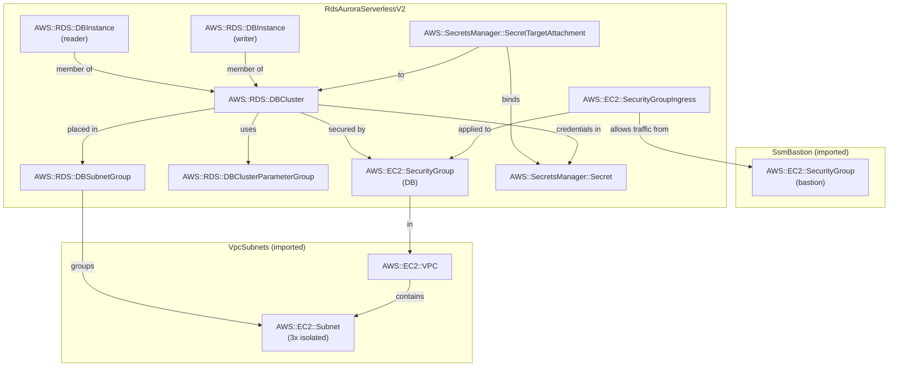

# rds-aurora-serverless-v2

Aurora Serverless v2 cluster with a writer and one reader instance. Both instances auto-scale in 0.5 ACU increments and auto-pause to zero compute after 5 minutes of idle.

```
┌──────────────────────────────────────────────────────────┐
│                    Aurora Cluster                        │
│                                                          │
│  ┌───────────────────┐    ┌───────────────────┐          │
│  │  Writer           │    │  Reader1          │          │
│  │  Serverless v2    │    │  Serverless v2    │          │
│  │  0–16 ACU         │    │  0–16 ACU         │          │
│  │  (auto-pause)     │    │  (scaleWithWriter)│          │
│  └────────┬──────────┘    └────────┬──────────┘          │
│           │                        │                     │
│  ┌────────▼────────────────────────▼──────────────────┐  │
│  │           Shared Distributed Storage               │  │
│  │      (6 copies × 3 AZs, auto-grows to 256 TiB)     │  │
│  └────────────────────────────────────────────────────┘  │
└──────────────────────────────────────────────────────────┘
          ▲                       ▲
    writer endpoint         reader endpoint
    (SSM tunnel :5432)      (SSM tunnel :5433)
```

Components:

- [Aurora PostgreSQL](https://docs.aws.amazon.com/AmazonRDS/latest/AuroraUserGuide/Aurora.AuroraPostgreSQL.html) 17.7 — writer instance handles reads + writes; reader serves read-only traffic via the reader endpoint
- [Aurora Serverless v2](https://docs.aws.amazon.com/AmazonRDS/latest/AuroraUserGuide/aurora-serverless-v2.html) — compute scales in 0.5 ACU steps (1 ACU ≈ 2 GiB RAM) from 0 to 16 ACU, measured every second
- [Auto-pause](https://docs.aws.amazon.com/AmazonRDS/latest/AuroraUserGuide/aurora-serverless-v2-auto-pause.html) — writer and tier 0-1 readers shut down compute together after 5 min idle; resumes on next connection (~15s)
- [AWS Secrets Manager](https://docs.aws.amazon.com/secretsmanager/latest/userguide/intro.html) — stores the generated `postgres` user credentials
- [Performance Insights](https://docs.aws.amazon.com/AmazonRDS/latest/AuroraUserGuide/USER_PerfInsights.html) — activates automatically when instance is above 2 ACU; free for 7-day retention
- [Enhanced Monitoring](https://docs.aws.amazon.com/AmazonRDS/latest/AuroraUserGuide/USER_Monitoring.OS.overview.html) — OS-level metrics at 60s granularity

---

## Cost

Region: `eu-central-1`. Workload assumption: light dev usage (~2 ACU average, 4h/day active).

| Resource               | Idle (auto-paused) | ~Active      | Cost driver                    |
| ---------------------- | ------------------ | ------------ | ------------------------------ |
| Writer (Serverless v2) | $0                 | $0.12/ACU-hr | ACU × hours consumed           |
| Reader (Serverless v2) | $0                 | $0.12/ACU-hr | ACU × hours consumed           |
| Storage                | $0.10/GB-mo        | —            | Minimum ~10 GB allocated       |
| I/O                    | $0.20/million      | —            | Read/write requests            |
| Performance Insights   | $0                 | $0           | 7-day retention included free  |
| Enhanced Monitoring    | ~$0.01/mo          | —            | One metric stream per instance |
| Secrets Manager        | $0.40/mo           | —            | One secret                     |

**Idle cost (auto-paused)**: ~$1/mo (storage only — minimum ~10 GB × $0.10).

**Active cost example**: 2 instances × 2 ACU avg × $0.12/ACU-hr × 4h × 30 days = ~$5.76/mo. Far cheaper than the ~$43/mo floor of a provisioned `t4g.medium` that runs 24/7.

**Cost crossover with I/O Optimized**: Switch to `AURORA_IOPT1` storage when I/O charges exceed ~25% of total Aurora spend. At light dev usage, Standard is always cheaper.

---

## When to use Serverless v2

**Ideal for**:

- Variable or spiky workloads where traffic can vary 2–10× within minutes
- Dev/test environments — auto-pause eliminates compute cost during idle hours
- New projects with unknown traffic patterns

**Not ideal for**:

- Steady high-throughput production — provisioned instances are cheaper per compute-hour; ACU-hour pricing carries a premium over equivalent provisioned vCPU-hours
- Latency-sensitive production with auto-pause enabled — the ~15s resume penalty is visible to users
- Predictable workloads — provisioned instances with scheduled scaling are simpler and cheaper

---

## Notes

**ACU scaling behavior**: Scaling is fully non-disruptive — it works mid-transaction with no connection drops. The engine measures load every second. Higher current ACU = faster absolute scale-up (e.g. 8→16 ACU is faster than 0.5→16 ACU because larger step sizes are unlocked). If your workload has sudden spikes, consider a higher min ACU to reduce scale-up latency.

**Auto-pause**: After 5 minutes of idle, compute shuts down. First connection after pause waits ~15s (AWS resumes the instances). After extended idle (>24h), resume can take 30s+. Auto-pause is suitable for dev/test but **not recommended for production** — transient connection timeouts during resume are visible to users.

**`scaleWithWriter: true` (promotion tier 0-1)**: The reader always scales up to at least the writer's current ACU before the writer reaches its target. This ensures the reader is always a viable failover candidate. Without this (`scaleWithWriter: false`, tier 2+), the reader scales independently based on its own read load — suitable for read-scaling replicas where failover speed is less critical.

**Buffer cache eviction on scale-down**: When an instance scales down, Aurora evicts pages from the buffer cache to free memory. This can cause a temporary latency spike (reads that were cache-hits become I/O-bound) until the cache warms back up. This is the primary production risk of a very low min ACU. **Production recommendation**: set `serverlessV2MinCapacity: 2` to keep a warm cache floor.

**Performance Insights below 2 ACU**: PI silently deactivates when the instance is below 2 ACU. At `minCapacity: 0`, PI will not collect data during auto-pause or at minimum scale. In production (min ACU ≥ 2), PI is always active.

**Key CloudWatch metrics for Serverless v2**:

- `ServerlessDatabaseCapacity` — current ACU of the instance. Alert when sustained near `serverlessV2MaxCapacity`.
- `ACUUtilization` — ratio of current ACU to max ACU. Alert at >90% to detect max ACU constraint.
- `BufferCacheHitRatio` — should stay >99%. A drop signals scale-down eviction or cache pressure.
- `DatabaseConnections` — alert at >80% of `max_connections`. Value is **static**, computed from max ACU at boot (with min=0: capped at 2,000 regardless of max ACU; with min≥1 and max=16: 3,360). Cannot be set manually — always derived from max ACU. Requires a cluster reboot after changing `serverlessV2MaxCapacity` to take effect.

**`serverlessV2MinCapacity` implications**:

| Min ACU | Auto-pause        | Performance Insights           | Buffer cache                | max_connections                       |
| ------- | ----------------- | ------------------------------ | --------------------------- | ------------------------------------- |
| 0       | Yes (~15s resume) | Off when paused or below 2 ACU | Fully evicted on pause      | Capped at 2,000                       |
| 0.5     | No                | Off below 2 ACU                | ~1 GiB (minimal warm floor) | Capped at 2,000                       |
| 2+      | No                | Always active                  | ≥4 GiB warm floor           | Normal formula (e.g. 3,360 at max 16) |

**Production recommendations summary**:

- Set `serverlessV2MinCapacity: 2` (required for always-on PI; better cold-start; warmer buffer cache)
- Remove `serverlessV2AutoPauseDuration` (disable auto-pause)
- Tune `serverlessV2MaxCapacity` to at least 2× your measured peak ACU (room to absorb spikes without hitting the ceiling)
- Add a tier 2+ reader for read-scaling beyond HA

---

## Commands to play with stack

**Deploy**:

```bash
npx cdk deploy SsmBastion RdsAuroraServerlessV2
```

**Open SSM tunnels** (two terminals):

```bash
# Terminal 1 — writer endpoint (RW)
BASTION=$(aws cloudformation describe-stacks --stack-name SsmBastion \
  --query "Stacks[0].Outputs[?OutputKey=='BastionInstanceId'].OutputValue" --output text)

WRITER=$(aws cloudformation describe-stacks --stack-name RdsAuroraServerlessV2 \
  --query "Stacks[0].Outputs[?OutputKey=='WriterEndpoint'].OutputValue" --output text)

aws ssm start-session --target $BASTION \
  --document-name AWS-StartPortForwardingSessionToRemoteHost \
  --parameters "{\"host\":[\"$WRITER\"],\"portNumber\":[\"5432\"],\"localPortNumber\":[\"5432\"]}"
```

```bash
# Terminal 2 — reader endpoint (RO)
READER=$(aws cloudformation describe-stacks --stack-name RdsAuroraServerlessV2 \
  --query "Stacks[0].Outputs[?OutputKey=='ReaderEndpoint'].OutputValue" --output text)

aws ssm start-session --target $BASTION \
  --document-name AWS-StartPortForwardingSessionToRemoteHost \
  --parameters "{\"host\":[\"$READER\"],\"portNumber\":[\"5432\"],\"localPortNumber\":[\"5433\"]}"
```

**Start demo server**:

```bash
AWS_REGION=eu-central-1 npx ts-node patterns/rds/demo_server.ts rds-aurora-serverless-v2
```

> If the cluster is auto-paused, the demo server's first connection attempt will time out (5s client timeout < ~15s resume time). The built-in retry loop handles this automatically — expect 2–3 retries (~15–20s total) before the server is ready.

**Interact**:

```bash
# Write a quote
curl -s -X POST http://localhost:3000/quotes \
  -H 'Content-Type: application/json' \
  -d '{"text":"Premature optimization is the root of all evil.","author":"Knuth"}' | jq

# Read all quotes (via reader endpoint)
curl -s http://localhost:3000/quotes | jq

# Write-read test (demonstrates near-zero replication lag on shared storage)
curl -s http://localhost:3000/write-read-test | jq

# Health check (shows pool stats for both writer and reader)
curl -s http://localhost:3000/health | jq
```

**Observe ACU scaling** (watch ServerlessDatabaseCapacity metric):

```bash
# Poll current ACU of writer instance every 10s
watch -n 10 'aws cloudwatch get-metric-statistics \
  --namespace AWS/RDS \
  --metric-name ServerlessDatabaseCapacity \
  --dimensions Name=DBInstanceIdentifier,Value=aurora-serverless-v2-writer \
  --start-time $(date -u -v-5M +"%Y-%m-%dT%H:%M:%SZ") \
  --end-time $(date -u +"%Y-%m-%dT%H:%M:%SZ") \
  --period 60 --statistics Average \
  --query "Datapoints[0].Average" --output text'
```

**Destroy**:

```bash
npx cdk destroy SsmBastion RdsAuroraServerlessV2
```

**Capture CloudFormation template**:

```bash
npx cdk synth RdsAuroraServerlessV2 > patterns/rds/rds-aurora-serverless-v2/cloud_formation.yaml
```

## Entity Relation of AWS Resources


