# RDS CDC Streaming

Change Data Capture from RDS PostgreSQL to Kinesis Data Streams via AWS DMS, consumed by Lambda with idempotency.

```
┌──────────────────┐   logical    ┌────────────────────┐   JSON    ┌─────────────────────────┐
│  RDS PostgreSQL  │──────────────▶  AWS DMS (CDC)      │──────────▶  Kinesis Data Streams   │
│  (quotes table)  │  replication │  full-load + CDC    │  records │  (1 shard, provisioned) │
└──────────────────┘              └────────────────────┘           └────────────┬────────────┘
                                                                                │ poll (Lambda ESM)
                                                                                ▼
                                                              ┌─────────────────────────────┐
                                                              │  Lambda (CDC Processor)     │
                                                              │  1. base64 decode           │
                                                              │  2. dedup check (DynamoDB)  │
                                                              │  3. log event               │
                                                              │     ↳ plug in SES/SNS here  │
                                                              └──────────────┬──────────────┘
                                                                             │ on failure
                                                                             ▼
                                                                    ┌──────────────┐
                                                                    │  SQS DLQ     │
                                                                    └──────────────┘
```

**Components:**

- **[RDS PostgreSQL](https://docs.aws.amazon.com/AmazonRDS/latest/UserGuide/CHAP_PostgreSQL.html)** (t4g.micro) — source of truth. Parameter group enables [logical replication](https://www.postgresql.org/docs/current/logical-replication.html) (`rds.logical_replication=1`), which switches the WAL level to `logical` so DMS can read row-level changes.
- **[AWS DMS](https://docs.aws.amazon.com/dms/latest/userguide/Welcome.html)** — provisioned replication instance (t3.micro) reads the [replication slot](https://www.postgresql.org/docs/current/logicaldecoding-explanation.html#LOGICALDECODING-REPLICATION-SLOTS) on RDS via the `pglogical` plugin. Initial full-load snapshots existing rows; CDC then streams changes as JSON to Kinesis.
- **[Kinesis Data Streams](https://docs.aws.amazon.com/streams/latest/dev/introduction.html)** — 1 shard, provisioned. Each shard delivers up to 1,000 records/s and 1 MB/s. DMS partitions records by `schema.table.pk` to distribute load across shards.
- **[Lambda](https://docs.aws.amazon.com/lambda/latest/dg/welcome.html)** — polls Kinesis, base64-decodes the DMS JSON payload, deduplicates via DynamoDB, and logs the event. Replace the `console.log` with `SES.SendEmail`, `SNS.Publish`, or any downstream action.
- **[DynamoDB](https://docs.aws.amazon.com/amazondynamodb/latest/developerguide/Introduction.html)** (dedup table) — stores processed event IDs with a 24-hour TTL. Guards against at-least-once Kinesis delivery causing duplicate actions.
- **[SQS DLQ](https://docs.aws.amazon.com/AWSSimpleQueueService/latest/SQSDeveloperGuide/sqs-dead-letter-queues.html)** — receives CDC records that exhaust Lambda retries. Inspect dead letters to diagnose persistent processing failures without losing the original event.

---

## Folder Structure

This pattern is split into three stacks to separate lifecycle boundaries (Database → DMS → Consumer).

- **[stack_rds.ts](./stack_rds.ts)** — defines the source RDS PostgreSQL instance and the Parameter Group that enables logical replication (`rds.logical_replication=1`).
- **[stack_dms.ts](./stack_dms.ts)** — configures the DMS replication instance and the CDC task that streams `public.quotes` changes to Kinesis.
- **[stack_lambda.ts](./stack_lambda.ts)** — defines the Kinesis Data Stream, the DynamoDB idempotency table, and the consumer Lambda function.
- **[handler.ts](./handler.ts)** — the CDC processor logic; handles Kinesis decoding, DynamoDB-based deduplication, and poison-pill detection.

---

## Cost

Region: `eu-central-1`. Idle (no writes). Prices approximate.

| Resource                  | Idle        | ~100 inserts/day | Cost driver               |
| ------------------------- | ----------- | ---------------- | ------------------------- |
| RDS t4g.micro (Single-AZ) | ~$13/mo     | ~$13/mo          | Instance-hour             |
| DMS dms.t3.small (50 GB)  | ~$25/mo     | ~$25/mo          | Instance-hour (always on) |
| Kinesis 1 shard           | ~$1/mo      | ~$1/mo           | Shard-hour                |
| Lambda                    | ~$0         | ~$0              | Invocation count          |
| DynamoDB (on-demand)      | ~$0         | ~$0              | Request count             |
| SQS DLQ                   | ~$0         | ~$0              | Message count             |
| **Total**                 | **~$39/mo** | **~$39/mo**      | DMS instance dominates    |

**Cost driver:** DMS is always-on and billed per instance-hour regardless of write activity. We use `dms.t3.small` as it is the most widely available entry-level class. This is why provisioned wins over Serverless for sustained CDC: Serverless charges ~$0.115/DCU-hr minimum (~$84/mo), >2× the provisioned cost for always-on workloads.

---

## Notes
### Why provisioned DMS over Serverless?

Serverless DMS is priced per DCU-hour and auto-scales — ideal for bursty migrations. For always-on CDC, provisioned is cheaper and provides features critical for production:

- **Custom CDC start point** — after a task failure, you can resume from a specific LSN (log sequence number) rather than doing a full reload.
- **Direct disk/memory control** — you choose storage (50 GB here) and can monitor swap usage to prevent lag accumulation before it compounds.

### Why Kinesis VPC Endpoint instead of NAT Gateway?

The DMS replication instance is placed in **Isolated Subnets** to ensure it can reach the RDS instance securely within the VPC. However, DMS must also verify and write to the Kinesis target stream, which normally requires internet access.

This pattern uses a **Kinesis VPC Interface Endpoint** (`com.amazonaws.<region>.kinesis-streams`) instead of a NAT Gateway for two reasons:

1.  **Cost:** A NAT Gateway costs ~$33/mo (in `eu-central-1`) plus data processing fees (~$0.045/GB). A VPC Endpoint costs ~$7-22/mo (depending on AZs) and has a 75% lower data processing fee (~$0.01/GB).
2.  **Security:** Traffic to Kinesis stays entirely on the private AWS network and never traverses the public internet. It also eliminates the need to open up a general outbound internet route for the replication instance, maintaining the "Isolated" tier's security posture.

---

## Prerequisites

The DMS source endpoint is configured with `heartbeatEnable=true`. Every 5 minutes, DMS writes a tiny heartbeat transaction to the `public` schema. This advances the replication slot's `restart_lsn` (the oldest WAL position PostgreSQL must retain).

Without heartbeat: if the **replicated table** (`quotes`) is idle but other tables in the database have writes, those WAL segments accumulate because the slot's LSN hasn't moved past them. On a busy database, hours of idle time can accumulate gigabytes of WAL. On RDS, storage exhaustion causes the database to go **read-only** — impacting all application traffic, not just DMS.

### Why `wal_sender_timeout=0`?

The default RDS value is 30,000 ms (30 seconds). If the DMS connection is idle for longer than this (e.g., during a low-traffic period), PostgreSQL terminates the WAL sender connection. This stops heartbeats and freezes the slot's LSN. Setting to `0` disables the timeout, keeping the DMS connection alive indefinitely.

### Idempotency: at-least-once delivery

Kinesis guarantees **at-least-once** delivery. Lambda retries on error. Combined, a single CDC event can invoke the Lambda handler 2–N times. Without a dedup guard, this means duplicate database writes, duplicate emails, or duplicate API calls.

This pattern uses a **DynamoDB conditional write** (`attribute_not_exists(eventId)`) as the idempotency guard. The key is `schema.table.pk.operation.transaction_id`. If the write fails with `ConditionalCheckFailedException`, the event was already processed — skip it. The 24-hour TTL keeps the table from growing unboundedly.

### Partial batch response (`reportBatchItemFailures`)

Without this flag, any Lambda error retries the **entire** Kinesis batch. If 9 out of 10 records succeeded, all 9 are re-processed — causing duplicate DynamoDB writes (caught by dedup) and wasted Lambda invocations.

With `reportBatchItemFailures: true`, Lambda returns `{ batchItemFailures: [{ itemIdentifier: sequenceNumber }] }` for only the failed records. Combined with `bisectBatchOnError: true`, Lambda splits failing batches in half to isolate poison-pill records efficiently.

### Table mappings: `public.quotes` only

The DMS task is scoped to the `quotes` table. DMS creates and manages the replication slot; it will only stream changes to that table. Adding more tables requires updating the `tableMappings` JSON and restarting the task.

---

## Failure Modes

### 1. Stopped DMS task → WAL fills RDS → database goes read-only

When a DMS task stops (intentionally or due to failure), the replication slot stays open. PostgreSQL retains all WAL from the slot's `restart_lsn` forward. WAL accumulates at the rate of all database writes — not just the replicated table.

| DMS downtime               | Risk                                                          |
| -------------------------- | ------------------------------------------------------------- |
| Minutes                    | Negligible                                                    |
| Hours                      | Potentially GB on a busy OLTP DB                              |
| Days                       | Can fill RDS storage → DB read-only → full application outage |
| Indefinite (slot orphaned) | Guaranteed eventual storage exhaustion                        |

**Mitigation:** Set a CloudWatch alarm on `OldestReplicationSlotLag` > 10 GB on the RDS instance. If DMS is stopped for > 30 minutes, drop the slot manually:

```sql
SELECT pg_drop_replication_slot('dms_cdc_slot');
```

Then restart DMS as a full-load-and-cdc task.

**Monitor orphaned slots:**

```sql
SELECT slot_name, active, pg_size_pretty(pg_wal_lsn_diff(pg_current_wal_lsn(), restart_lsn)) AS lag
FROM pg_replication_slots;
```

### 2. DMS replication instance disk full

DMS uses disk for task logs and for **swapped CDC events** — when in-flight changes exceed the instance's memory limit (`MemoryKeepTime` or `MemoryLimitTotal`), they spill to disk. If disk fills, DMS stops. This then triggers failure mode #1.

**Monitor:** `FreeStorageSpace` CloudWatch metric on the DMS replication instance. Alert below 5 GB.

### 3. Hot Kinesis shard from low-cardinality partition key

DMS partitions records by `schema.table.pk` (with `partitionIncludeSchemaTable: true`). If your table's primary key has low cardinality (e.g., a small sequential ID with many tables), multiple tables' events can hash to the same shard → `WriteProvisionedThroughputExceeded` → DMS retries → CDCLatencyTarget rises.

**Monitor:** `WriteProvisionedThroughputExceeded` on the Kinesis stream. Any non-zero value means throttling.

### 4. Lambda duplicate processing without idempotency

Kinesis is at-least-once. A Lambda retry (due to `bisectBatchOnError` or a transient error) re-delivers the same CDC event. Without the DynamoDB dedup guard, downstream actions (emails, writes, API calls) execute twice.

This pattern handles this correctly. If you swap in a different downstream action, ensure it also handles idempotency.

### 5. `wal_sender_timeout` too short → connection drops

If `wal_sender_timeout` is set to a value between 1–9999 ms, DMS fails immediately. Values between 10,000–60,000 ms may cause the WAL sender to drop during low-traffic windows. Set to `0` (disabled) or ≥ 60,000 ms.

---

## Monitoring

| Metric                               | Where           | Alarm threshold    | Meaning                                                          |
| ------------------------------------ | --------------- | ------------------ | ---------------------------------------------------------------- |
| `CDCLatencySource`                   | DMS task        | > 60 s             | DMS can't read WAL fast enough; check slot and instance health   |
| `CDCLatencyTarget`                   | DMS task        | > 120 s            | DMS can't write to Kinesis fast enough; check stream throttling  |
| `FreeStorageSpace`                   | DMS instance    | < 5 GB             | Disk filling; swap events or task logs accumulating              |
| `FreeableMemory`                     | DMS instance    | < 200 MB           | Approaching swap territory                                       |
| `OldestReplicationSlotLag`           | RDS instance    | > 10 GB            | WAL not being consumed at write rate; slot at risk               |
| `WriteProvisionedThroughputExceeded` | Kinesis stream  | Any non-zero       | DMS records throttled; consider more shards or fix partition key |
| `GetRecords.IteratorAgeMilliseconds` | Kinesis stream  | > 10 min           | Lambda consumer falling behind; records approaching expiry       |
| `Errors`                             | Lambda function | Any non-zero trend | Check DLQ for failed CDC records                                 |

---

## Prerequisites

AWS DMS requires two mandatory service roles to exist in your account: `dms-vpc-role` and `dms-cloudwatch-logs-role`.

This is a **drawback of DMS's legacy design**: unlike modern AWS services (like Glue Zero-ETL) that use Service-Linked Roles or explicit role ARNs, DMS looks up these roles strictly by these **hardcoded names** at the account level. Attempting to manage these within a CDK stack often leads to "Role already exists" or race-condition errors during CloudFormation validation.

To avoid these issues, you must create these roles **manually** once per account using the AWS CLI before deploying this pattern:

```bash
# 1. Create the VPC management role
aws iam create-role --role-name dms-vpc-role \
  --assume-role-policy-document '{"Version":"2012-10-17","Statement":[{"Effect":"Allow","Principal":{"Service":"dms.amazonaws.com"},"Action":"sts:AssumeRole"}]}'
aws iam attach-role-policy --role-name dms-vpc-role \
  --policy-arn arn:aws:iam::aws:policy/service-role/AmazonDMSVPCManagementRole

# 2. Create the CloudWatch logs role
aws iam create-role --role-name dms-cloudwatch-logs-role \
  --assume-role-policy-document '{"Version":"2012-10-17","Statement":[{"Effect":"Allow","Principal":{"Service":"dms.amazonaws.com"},"Action":"sts:AssumeRole"}]}'
aws iam attach-role-policy --role-name dms-cloudwatch-logs-role \
  --policy-arn arn:aws:iam::aws:policy/service-role/AmazonDMSCloudWatchLogsRole
```

## Commands to play with stack

### Deploy

```bash
cdk deploy VpcSubnets SsmBastion RdsCdcStreamingRds RdsCdcStreamingDms RdsCdcStreamingLambda
```

After deploying, you must manually start the DMS task to begin the initial full load and CDC streaming.

### Interact

Start the DMS task:

```bash
# Get the DMS Task ARN from stack outputs
TASK_ARN=$(aws cloudformation describe-stacks --stack-name RdsCdcStreamingDms \
  --query "Stacks[0].Outputs[?OutputKey=='DmsTaskArn'].OutputValue" --output text)

# Start the task (Full Load + CDC)
aws dms start-replication-task --replication-task-arn $TASK_ARN --start-replication-task-type start-replication
```

Open two SSM tunnels first (in separate terminals):

```bash
# Tunnel 1: RDS on localhost:5432
INSTANCE_ID=$(aws ec2 describe-instances \
  --filters "Name=tag:aws:cloudformation:stack-name,Values=SsmBastionStack" \
  --query "Reservations[0].Instances[0].InstanceId" --output text)
aws ssm start-session --target $INSTANCE_ID \
  --document-name AWS-StartPortForwardingSessionToRemoteHost \
  --parameters "{\"host\":[\"$(aws cloudformation describe-stacks --stack-name RdsCdcStreamingRds --query \"Stacks[0].Outputs[?OutputKey=='DbEndpoint'].OutputValue\" --output text)\"],\"portNumber\":[\"5432\"],\"localPortNumber\":[\"5432\"]}"
```

Start the demo server (reusing the shared RDS demo server):

```bash
AWS_REGION=eu-central-1 npx ts-node patterns/rds/demo_server.ts rds-cdc-streaming
```

Trigger CDC events:

```bash
# Insert a quote → DMS captures the INSERT → Kinesis → Lambda
curl -s -X POST http://localhost:3000/quotes \
  -H "Content-Type: application/json" \
  -d '{"text": "The only way to do great work is to love what you do.", "author": "Steve Jobs"}'

# Insert several more to see multiple CDC events
curl -s -X POST http://localhost:3000/quotes \
  -H "Content-Type: application/json" \
  -d '{"text": "Stay hungry, stay foolish.", "author": "Steve Jobs"}'
```

Trigger a poison-pill record (tests bisect-on-error and DLQ routing):

```bash
# The handler throws when the text field contains "[POISON_PILL]" — this record will end up in the DLQ
psql "host=localhost port=5432 dbname=demo user=postgres sslmode=require" \
  -c "INSERT INTO quotes (text, author) VALUES ('[POISON_PILL] bad record', 'test');"
```

### Observe

Watch Lambda logs for processed CDC events:

```bash
aws logs tail /aws/lambda/rds-cdc-processor --follow
```

Check the DynamoDB dedup table to see processed event IDs:

```bash
aws dynamodb scan --table-name rds-cdc-dedup --output table
```

Inspect the DLQ for failed records:

```bash
DLQ_URL=$(aws cloudformation describe-stacks --stack-name RdsCdcStreamingLambda \
  --query "Stacks[0].Outputs[?OutputKey=='DLQUrl'].OutputValue" --output text)
aws sqs receive-message --queue-url $DLQ_URL
```

Check DMS task status and CDC lag:

```bash
TASK_ARN=$(aws cloudformation describe-stacks --stack-name RdsCdcStreamingDms \
  --query "Stacks[0].Outputs[?OutputKey=='DmsTaskArn'].OutputValue" --output text)
aws dms describe-replication-tasks \
  --filters "Name=replication-task-arn,Values=$TASK_ARN" \
  --query "ReplicationTasks[0].{Status:Status,LatencySource:ReplicationTaskStats.CDCLatencySource,LatencyTarget:ReplicationTaskStats.CDCLatencyTarget}"
```

Monitor replication slot lag on RDS (connect via bastion tunnel):

```bash
psql "host=localhost port=5432 dbname=demo user=postgres sslmode=require" \
  -c "SELECT slot_name, active, pg_size_pretty(pg_wal_lsn_diff(pg_current_wal_lsn(), restart_lsn)) AS lag FROM pg_replication_slots;"
```

### Synth (capture CloudFormation)

```bash
cdk synth RdsCdcStreamingRds > patterns/rds/rds-cdc-streaming/cloud_formation_rds.yaml
cdk synth RdsCdcStreamingDms > patterns/rds/rds-cdc-streaming/cloud_formation_dms.yaml
cdk synth RdsCdcStreamingLambda > patterns/rds/rds-cdc-streaming/cloud_formation_lambda.yaml
```

### Destroy

```bash
# Stop the DMS task first to avoid WAL accumulation during teardown
aws dms stop-replication-task --replication-task-arn $TASK_ARN

# Drop the replication slot on RDS (prevents WAL buildup after DMS is removed)
psql "host=localhost port=5432 dbname=demo user=postgres sslmode=require" \
  -c "SELECT pg_drop_replication_slot('dms_cdc_slot');"

# Destroy CDC stacks in reverse order, then the bastion (cost → ~$0)
cdk destroy RdsCdcStreamingLambda RdsCdcStreamingDms RdsCdcStreamingRds SsmBastion
```

---

## Entity Diagram

```mermaid
flowchart TB
    subgraph VpcSubnets["VpcSubnets (imported)"]
        VPC["AWS::EC2::VPC"]
        Subnet["AWS::EC2::Subnet\n(3x isolated)"]
    end

    subgraph SsmBastion["SsmBastion (imported)"]
        BastionSG["AWS::EC2::SecurityGroup\n(Bastion)"]
    end

    subgraph RDS["RdsCdcStreamingRds"]
        DbSG["AWS::EC2::SecurityGroup\n(DbSG)"]
        BastionToDb["AWS::EC2::SecurityGroupIngress\n(BastionToDb)"]
        SubnetGroup["AWS::RDS::DBSubnetGroup"]
        Secret["AWS::SecretsManager::Secret"]
        Attachment["AWS::SecretsManager::SecretTargetAttachment"]
        ParameterGroup["AWS::RDS::DBParameterGroup"]
        Instance["AWS::RDS::DBInstance"]
    end

    subgraph DMS["RdsCdcStreamingDms"]
        DmsSG["AWS::EC2::SecurityGroup\n(DmsSG)"]
        DmsToDb["AWS::EC2::SecurityGroupIngress\n(DmsToDb)"]
        DmsKinesisRole["AWS::IAM::Role\n(DmsKinesisRole)"]
        DmsPolicy["AWS::IAM::Policy\n(DefaultPolicy)"]
        CdcStream["AWS::Kinesis::Stream\n(CdcStream)"]
        ReplicationSubnetGroup["AWS::DMS::ReplicationSubnetGroup"]
        ReplicationInstance["AWS::DMS::ReplicationInstance"]
        SourceEndpoint["AWS::DMS::Endpoint\n(SourceEndpoint)"]
        TargetEndpoint["AWS::DMS::Endpoint\n(TargetEndpoint)"]
        ReplicationTask["AWS::DMS::ReplicationTask"]
    end

    subgraph LambdaStack["RdsCdcStreamingLambda"]
        ServiceRole["AWS::IAM::Role\n(ServiceRole)"]
        LambdaPolicy["AWS::IAM::Policy\n(DefaultPolicy)"]
        DedupTable["AWS::DynamoDB::GlobalTable\n(DedupTable)"]
        CdcDlq["AWS::SQS::Queue\n(CdcDlq)"]
        CdcProcessor["AWS::Lambda::Function\n(CdcProcessor)"]
        KinesisESM["AWS::Lambda::EventSourceMapping\n(KinesisEventSource)"]
    end

    VPC --> |contains| Subnet

    DbSG --> |in| VPC
    BastionToDb --> |added to| DbSG
    BastionToDb --> |allows traffic from| BastionSG
    SubnetGroup --> |placed in| Subnet
    Attachment --> |links| Secret
    Attachment --> |links to| Instance
    Instance --> |uses| ParameterGroup
    Instance --> |placed in| SubnetGroup
    Instance --> |references| Secret
    Instance --> |secured by| DbSG

    DmsPolicy --> |allows access to| CdcStream
    DmsPolicy --> |grants permissions to| DmsKinesisRole
    DmsSG --> |in| VPC
    DmsToDb --> |added to| DbSG
    DmsToDb --> |allows traffic from| DmsSG
    ReplicationSubnetGroup --> |placed in| Subnet
    ReplicationInstance --> |references| ReplicationSubnetGroup
    ReplicationInstance --> |references| DmsSG
    SourceEndpoint --> |reads credentials from| Attachment
    SourceEndpoint --> |references| Instance
    TargetEndpoint --> |references| DmsKinesisRole
    TargetEndpoint --> |references| CdcStream
    ReplicationTask --> |references| ReplicationInstance
    ReplicationTask --> |references| SourceEndpoint
    ReplicationTask --> |references| TargetEndpoint

    LambdaPolicy --> |allows stream read from| DedupTable
    LambdaPolicy --> |allows send to| CdcDlq
    LambdaPolicy --> |allows access to| CdcStream
    LambdaPolicy --> |grants permissions to| ServiceRole
    CdcProcessor --> |references| DedupTable
    CdcProcessor --> |runs as| ServiceRole
    KinesisESM --> |references| CdcDlq
    KinesisESM --> |streams from| CdcStream
    KinesisESM --> |invokes| CdcProcessor
```


