# rds-opensearch

Continuously sync RDS PostgreSQL data into Amazon OpenSearch Service using OpenSearch Ingestion (OSI) CDC — no custom sync code, no polling, no ETL pipeline.

```
                                     OSI Pipeline
                                  ┌───────────────────────────────────────────┐
RDS PostgreSQL 17.7               │  1. Snapshot export → S3 (initial load)   │
(db.t4g.micro, Single-AZ)         │  2. WAL logical replication (CDC stream)  │     OpenSearch 2.19
┌──────────────────────────┐  WAL │                                           │  ┌──────────────────┐
│  Instance                │──────▶  rds source plugin                        │  │  Domain          │
│  demo DB                 │ logi-│  ┌──────────────┐    ┌────────────────┐   │  │  2× t3.small     │
│  rds.logical_replication │ cal  │  │ initial load │───▶│ opensearch     │──▶│  │  articles index  │
│  = 1                     │ rep. │  │ (S3 Parquet) │    │ sink (bulk)    │   │  │  zone-aware      │
└──────────────────────────┘      │  └──────────────┘    └────────────────┘   │  │  (2 AZ, gp3)     │
        ▲                         │                                           │  └──────────────────┘
  SSM tunnel :5432                │  snapshot export ──▶ S3 Bucket            │
  (writes via psql)               └───────────────────────────────────────────┘
```

**Components:**

- **[Amazon RDS for PostgreSQL](https://docs.aws.amazon.com/AmazonRDS/latest/UserGuide/CHAP_PostgreSQL.html)** — relational source of truth. Parameter group sets `rds.logical_replication=1`, switching the WAL level to `logical` so OSI can open a replication slot and tail the change stream.
- **[Amazon OpenSearch Ingestion (OSI)](https://docs.aws.amazon.com/opensearch-service/latest/developerguide/ingestion.html)** — fully managed Data Prepper pipeline. The `rds` source plugin handles the full lifecycle: takes an RDS snapshot, exports it to S3 as Parquet, bulk-indexes it into OpenSearch, then switches to continuous CDC via logical replication.
- **[Amazon S3](https://docs.aws.amazon.com/AmazonS3/latest/userguide/Welcome.html)** — staging bucket for the initial snapshot export (Parquet files). OSI deletes objects after indexing them.
- **[AWS KMS](https://docs.aws.amazon.com/kms/latest/developerguide/overview.html)** — encrypts the RDS snapshot export. Required by the RDS snapshot export API.
- **[Amazon OpenSearch Service](https://docs.aws.amazon.com/opensearch-service/latest/developerguide/what-is.html)** — search destination. CDC operations are mapped to bulk actions: INSERT/UPDATE → index (upsert), DELETE → delete.

---

**Folder Structure:**

- [`stack_rds.ts`](./stack_rds.ts) — RDS PostgreSQL instance with logical replication enabled
- [`stack_opensearch.ts`](./stack_opensearch.ts) — OpenSearch provisioned domain (2 data nodes, zone-aware)
- [`stack_pipeline.ts`](./stack_pipeline.ts) — OSI pipeline, S3 snapshot bucket, KMS key, IAM roles
- [`stack.test.ts`](./stack.test.ts) — CDK assertion tests for all three stacks

---

## Cost

Region: eu-central-1. Workload: light demo writes.

> **Cost warning**: OSI is the dominant cost at ~$175/mo for a single OCU running 24/7. **Run `cdk destroy` immediately after experimenting.**

| Resource                            | Idle         | ~Light usage | Cost driver          |
| ----------------------------------- | ------------ | ------------ | -------------------- |
| RDS db.t4g.micro (Single-AZ)        | ~$13/mo      | ~$13/mo      | Instance hours       |
| OpenSearch 2× t3.small.search (gp3) | ~$50/mo      | ~$50/mo      | Instance hours       |
| OSI pipeline (1 OCU minimum)        | ~$175/mo     | ~$175/mo     | OCU-hours ($0.24/hr) |
| S3 snapshot bucket + KMS            | ~$1/mo       | ~$1/mo       | Storage + API calls  |
| **Total**                           | **~$239/mo** | **~$239/mo** |                      |

**Dominant cost driver**: OSI at $0.24/OCU-hr × 730 hrs × 1 OCU = ~$175/mo. There is no scale-to-zero option for OSI — it bills per OCU-hour regardless of ingestion volume. `maxUnits: 4` is the auto-scale ceiling; `minUnits: 1` is the floor. **Run `cdk destroy` immediately after experimenting.**

---

## Notes

### 1. CDC Mechanics: How OSI Replicates RDS

OSI uses the PostgreSQL [logical replication](https://www.postgresql.org/docs/current/logical-replication.html) protocol, not JDBC polling. When the pipeline starts:

1. OSI calls `CreateDBSnapshot` on the RDS instance and waits for it to complete.
2. OSI calls `StartExportTask` (via the export IAM role) to write the snapshot as Parquet to the S3 bucket.
3. OSI reads the Parquet files and bulk-indexes them into OpenSearch (initial full load).
4. OSI opens a [logical replication slot](https://www.postgresql.org/docs/current/logicaldecoding-explanation.html#LOGICALDECODING-REPLICATION-SLOTS) on RDS and tails the WAL from the LSN at which the snapshot was taken. INSERTs, UPDATEs, and DELETEs all flow through.

The `document_version_type: "external"` in the sink config uses the WAL LSN as an optimistic concurrency token. OpenSearch rejects stale events (e.g. a delayed UPDATE arriving after a newer DELETE), preventing data corruption during pipeline restarts.

### 2. Prerequisites

| Requirement               | Detail                                                                                                                                                       |
| ------------------------- | ------------------------------------------------------------------------------------------------------------------------------------------------------------ |
| PostgreSQL version        | 16 or higher (this pattern uses 17.7 ✓)                                                                                                                      |
| `rds.logical_replication` | Must be `1` in the parameter group — requires instance reboot on first enable                                                                                |
| Primary keys              | All replicated tables **must** have a `PRIMARY KEY`. Without PKs, OSI cannot generate a stable `document_id` and data consistency is not guaranteed          |
| Single database           | One OSI pipeline supports one PostgreSQL database                                                                                                            |
| Same region/account       | RDS instance and OSI pipeline must be in the same AWS Region and account                                                                                     |
| Multi-AZ DB clusters      | **NOT supported**. Single-instance RDS (Multi-AZ Standard OK) and Aurora are supported; the [Multi-AZ DB cluster topology](../rds-readable-standbys/) is not |

### 3. Failure Modes

**WAL accumulation (most critical)**
The logical replication slot holds WAL on disk until OSI has consumed and confirmed it. If the pipeline stops (error, manual stop, deploy), the slot remains open and WAL accumulates. On a busy database with a stalled slot, RDS disk can fill up within hours or days, causing write failures.

_Monitor_: `TransactionLogsDiskUsage` CloudWatch metric on the RDS instance. Alert when it exceeds 1 GB (or 10% of your allocated storage, whichever is less). If you stop the pipeline intentionally, drop the replication slot manually:

```sql
SELECT pg_drop_replication_slot(slot_name)
FROM pg_replication_slots
WHERE slot_name LIKE 'osis_%';
```

**DDL changes break the CDC stream**
OSI does not handle DDL automatically. Any of the following break data consistency:

- Adding, dropping, or renaming a column
- Changing a column's data type
- Adding or removing a `PRIMARY KEY`
- `TRUNCATE` or `DROP TABLE`

After a breaking DDL change, stop the pipeline and redeploy with the updated `tables` config to trigger a new full-load snapshot.

**Snapshot export duration**
The initial full load takes time proportional to database size. A 20 GB database may take 15–30 minutes to export and index. OSI does not serve search queries during the initial load. Schedule the first deploy during a low-traffic window for large datasets.

**Credential rotation window**
The pipeline caches Secrets Manager credentials with `refresh_interval: PT1H`. If you rotate the RDS password, OSI will use the old password for up to 1 hour before re-reading the secret. RDS keeps the old password valid for a brief overlap period during rotation — ensure your rotation strategy supports this window (Secrets Manager's built-in rotation does).

**OSI pipeline warm-up**
Creating an OSI pipeline takes 5–10 minutes before it transitions to `ACTIVE`. CloudFormation waits for the pipeline to reach `ACTIVE` before marking the resource as created. Budget ~15 minutes for a first deploy.

### 4. IAM Roles

Two IAM roles are required:

| Role           | Trusted by                     | Purpose                                                                                                                                                                    |
| -------------- | ------------------------------ | -------------------------------------------------------------------------------------------------------------------------------------------------------------------------- |
| `ExportRole`   | `export.rds.amazonaws.com`     | Writes snapshot Parquet to S3; needs S3 read/write/delete and KMS encrypt/decrypt                                                                                          |
| `PipelineRole` | `osis-pipelines.amazonaws.com` | Orchestrates everything: calls `CreateDBSnapshot`, `StartExportTask` (passing ExportRole), reads S3, reads Secrets Manager, writes to OpenSearch, manages its own VPC ENIs |

### 5. OpenSearch Index Mapping

OSI uses dynamic mapping by default. For production, create an explicit index template before starting the pipeline to control field types (especially dates, numbers, and geo fields). See the [data type mapping table](https://docs.aws.amazon.com/opensearch-service/latest/developerguide/rds-PostgreSQL.html) for PostgreSQL → OpenSearch field type defaults.

### 6. vs. Other Search Approaches

| Approach                                    | Replication                    | Delete detection               | Setup complexity            | Cost                          |
| ------------------------------------------- | ------------------------------ | ------------------------------ | --------------------------- | ----------------------------- |
| **OSI (this pattern)**                      | True CDC via WAL               | ✅ Yes                         | Medium                      | ~$239/mo                      |
| **JDBC polling (self-hosted Data Prepper)** | Poll-based, needs `updated_at` | ❌ No (hard deletes invisible) | Higher (ECS/EC2 management) | Lower (pay only when running) |
| **pg_vector**                               | In-DB, no replication          | N/A                            | Low                         | No extra cost                 |

`pg_vector` stores embeddings inside PostgreSQL using the `pgvector` extension. No data movement, no sync lag, but search throughput scales with your DB instance — not independently. Use it when your DB can handle the query load and you don't need OpenSearch's full-text ranking features.

---

## Commands (not yet verified !!!)

**Deploy** (in order — each stack depends on the previous):

```bash
npx cdk deploy RdsOpensearchRds RdsOpensearchOpenSearch RdsOpensearchPipeline
```

> OpenSearch domain creation takes ~15 minutes. OSI pipeline activation takes an additional 5–10 minutes. Budget 30 minutes for a first deploy.

---

**Set up SSM tunnel to RDS** (Terminal 1 — keep open):

```bash
# Fetch the bastion instance ID
BASTION_ID=$(aws cloudformation describe-stacks --stack-name SsmBastion \
  --query 'Stacks[0].Outputs[?OutputKey==`BastionInstanceId`].OutputValue' --output text)

# Fetch the RDS endpoint
DB_HOST=$(aws cloudformation describe-stacks \
  --stack-name RdsOpensearchRds \
  --query "Stacks[0].Outputs[?OutputKey=='DbEndpoint'].OutputValue" \
  --output text)

# Forward local :5432 → RDS :5432 through the bastion
aws ssm start-session \
  --target "$BASTION_ID" \
  --document-name AWS-StartPortForwardingSessionToRemoteHost \
  --parameters "{\"host\":[\"$DB_HOST\"],\"portNumber\":[\"5432\"],\"localPortNumber\":[\"5432\"]}"
```

---

**Seed data** (Terminal 2 — requires the SSM tunnel above):

```bash
# Fetch the secret ARN and retrieve credentials
SECRET_ARN=$(aws cloudformation describe-stacks \
  --stack-name RdsOpensearchRds \
  --query "Stacks[0].Outputs[?OutputKey=='SecretArn'].OutputValue" \
  --output text)

DB_PASSWORD=$(aws secretsmanager get-secret-value \
  --secret-id "$SECRET_ARN" \
  --query SecretString --output text | jq -r '.password')

# Create the articles table and insert rows
# Note: table must have a PRIMARY KEY for OSI to generate stable document IDs
PGPASSWORD="$DB_PASSWORD" psql -h 127.0.0.1 -U postgres -d demo <<'SQL'
CREATE TABLE IF NOT EXISTS articles (
  id     SERIAL PRIMARY KEY,
  title  TEXT NOT NULL,
  body   TEXT,
  author TEXT
);

INSERT INTO articles (title, body, author) VALUES
  ('Getting started with OpenSearch', 'Full-text search and analytics...', 'alice'),
  ('PostgreSQL logical replication',  'WAL-based CDC in depth...',          'bob'),
  ('CDK patterns for AWS',            'Infrastructure as code...',          'alice');
SQL
```

---

**Observe pipeline progress**:

```bash
# Check pipeline status (CREATING → ACTIVE)
PIPELINE_ARN=$(aws cloudformation describe-stacks \
  --stack-name RdsOpensearchPipeline \
  --query "Stacks[0].Outputs[?OutputKey=='PipelineArn'].OutputValue" \
  --output text)

aws osis get-pipeline --pipeline-name rds-opensearch-cdc \
  --query 'Pipeline.{Status:Status,Units:CurrentUnits}'

# Watch OSI CloudWatch metrics (after pipeline is ACTIVE)
# pipeline-name.rds.streamRecordsSuccessTotal — CDC events indexed
# pipeline-name.rds.exportRecordsProcessed   — snapshot records indexed
# pipeline-name.rds.exportRecordsFailedTotal — failed snapshot records
```

---

**Query OpenSearch** (requires the SSM tunnel; set up a second forward to port 9200 or use the domain endpoint directly from the bastion):

```bash
DOMAIN_ENDPOINT=$(aws cloudformation describe-stacks \
  --stack-name RdsOpensearchOpenSearch \
  --query "Stacks[0].Outputs[?OutputKey=='DomainEndpoint'].OutputValue" \
  --output text)

# List all indexed articles
curl -s -X GET "$DOMAIN_ENDPOINT/articles/_search?pretty" \
  -H 'Content-Type: application/json' \
  -d '{"query": {"match_all": {}}}' \
  --aws-sigv4 "aws:amz:eu-central-1:es" \
  --user "$(aws configure get aws_access_key_id):$(aws configure get aws_secret_access_key)"

# Full-text search
curl -s -X GET "$DOMAIN_ENDPOINT/articles/_search?pretty" \
  -H 'Content-Type: application/json' \
  -d '{"query": {"match": {"body": "replication"}}}' \
  --aws-sigv4 "aws:amz:eu-central-1:es" \
  --user "$(aws configure get aws_access_key_id):$(aws configure get aws_secret_access_key)"
```

---

**Test CDC (update/delete)**:

```bash
# Update a row — should reflect in OpenSearch within seconds
PGPASSWORD="$DB_PASSWORD" psql -h 127.0.0.1 -U postgres -d demo \
  -c "UPDATE articles SET body = 'Updated: WAL-based CDC in depth (revised)' WHERE id = 2;"

# Delete a row — document should be removed from OpenSearch
PGPASSWORD="$DB_PASSWORD" psql -h 127.0.0.1 -U postgres -d demo \
  -c "DELETE FROM articles WHERE id = 3;"
```

---

**Destroy** (reverse deploy order):

```bash
npx cdk destroy RdsOpensearchPipeline RdsOpensearchOpenSearch RdsOpensearchRds
```

> **Important**: Before destroying, check for active replication slots that may be holding WAL:
>
> ```bash
> PGPASSWORD="$DB_PASSWORD" psql -h 127.0.0.1 -U postgres -d demo \
>   -c "SELECT slot_name, active, pg_size_pretty(pg_wal_lsn_diff(pg_current_wal_lsn(), restart_lsn)) AS wal_behind FROM pg_replication_slots;"
> ```

---

**Capture CloudFormation YAML**:

```bash
cdk synth RdsOpensearchRds --output .temp > patterns/rds/rds-opensearch/cloud_formation_rds.yaml
cdk synth RdsOpensearchOpenSearch --output .temp > patterns/rds/rds-opensearch/cloud_formation_opensearch.yaml
cdk synth RdsOpensearchPipeline --output .temp > patterns/rds/rds-opensearch/cloud_formation_pipeline.yaml
```

---

## Entity Relationship Diagram of AWS Resources

```mermaid
flowchart TB
    subgraph VpcSubnets["VpcSubnets (imported)"]
        VPC["AWS::EC2::VPC"]
        Subnet["AWS::EC2::Subnet\n(3x isolated)"]
    end

    subgraph SsmBastion["SsmBastion (imported)"]
        BastionSG["AWS::EC2::SecurityGroup\n(Bastion)"]
    end

    subgraph RdsRds["RdsOpensearchRds"]
        DbSG["AWS::EC2::SecurityGroup\n(DbSG)"]
        BastionToDb["AWS::EC2::SecurityGroupIngress\n(BastionToDb)"]
        SubnetGrp["AWS::RDS::DBSubnetGroup\n(SubnetGroup)"]
        Secret["AWS::SecretsManager::Secret\n(Secret)"]
        Attachment["AWS::SecretsManager::SecretTargetAttachment\n(Attachment)"]
        ParamGroup["AWS::RDS::DBParameterGroup\n(ParameterGroup)"]
        Instance["AWS::RDS::DBInstance\n(Instance)"]
    end

    subgraph RdsOS["RdsOpensearchOpenSearch"]
        DomainSG["AWS::EC2::SecurityGroup\n(DomainSG)"]
        SlowLogs["AWS::Logs::LogGroup\n(SlowSearchLogs)"]
        AppLogs["AWS::Logs::LogGroup\n(AppLogs)"]
        Domain["AWS::OpenSearchService::Domain\n(Domain)"]
    end

    subgraph RdsPipeline["RdsOpensearchPipeline"]
        ExportKey["AWS::KMS::Key\n(ExportKey)"]
        BucketKey["AWS::KMS::Key\n(Key)"]
        SnapBucket["AWS::S3::Bucket\n(SnapshotBucket)"]
        BucketPolicy["AWS::S3::BucketPolicy\n(Policy)"]
        ExportRole["AWS::IAM::Role\n(ExportRole)"]
        ExportPolicy["AWS::IAM::Policy\n(DefaultPolicy)"]
        PipelineRole["AWS::IAM::Role\n(PipelineRole)"]
        PipePolicy["AWS::IAM::Policy\n(DefaultPolicy)"]
        PipelineSG["AWS::EC2::SecurityGroup\n(PipelineSG)"]
        PipeToRds["AWS::EC2::SecurityGroupIngress\n(PipelineToRds)"]
        PipeToOS["AWS::EC2::SecurityGroupIngress\n(PipelineToOpenSearch)"]
        OsiPipeline["AWS::OSIS::Pipeline\n(Pipeline)"]
    end

    VPC --> |contains| Subnet

    DbSG --> |in| VPC
    BastionToDb --> |added to| DbSG
    BastionToDb --> |allows traffic from| BastionSG
    SubnetGrp --> |placed in| Subnet
    Attachment --> |links| Secret
    Attachment --> |links to| Instance
    Instance --> |uses| ParamGroup
    Instance --> |placed in| SubnetGrp
    Instance --> |references| Secret
    Instance --> |secured by| DbSG

    DomainSG --> |in| VPC
    Domain --> |references| SlowLogs
    Domain --> |references| AppLogs
    Domain --> |secured by| DomainSG
    Domain --> |placed in| Subnet

    SnapBucket --> |references| ExportKey
    BucketPolicy --> |policy for| SnapBucket
    BucketPolicy --> |allows access to| SnapBucket
    ExportPolicy --> |allows access to| SnapBucket
    ExportPolicy --> |allows access to| BucketKey
    ExportPolicy --> |allows access to| ExportKey
    ExportPolicy --> |grants permissions to| ExportRole
    PipePolicy --> |allows access to| SnapBucket
    PipePolicy --> |allows access to| BucketKey
    PipePolicy --> |allows access to| ExportKey
    PipePolicy --> |allows access to| Attachment
    PipePolicy --> |allows access to| Instance
    PipePolicy --> |allows access to| ExportRole
    PipePolicy --> |allows access to| Domain
    PipePolicy --> |grants permissions to| PipelineRole
    PipelineSG --> |in| VPC
    PipeToRds --> |added to| DbSG
    PipeToRds --> |allows traffic from| PipelineSG
    PipeToOS --> |added to| Domain
    PipeToOS --> |allows traffic from| PipelineSG
    OsiPipeline --> |references| Instance
    OsiPipeline --> |references| SnapBucket
    OsiPipeline --> |references| ExportKey
    OsiPipeline --> |references| ExportRole
    OsiPipeline --> |references| PipelineRole
    OsiPipeline --> |references| Domain
    OsiPipeline --> |references| Attachment
    OsiPipeline --> |secured by| PipelineSG
    OsiPipeline --> |placed in| Subnet
```


