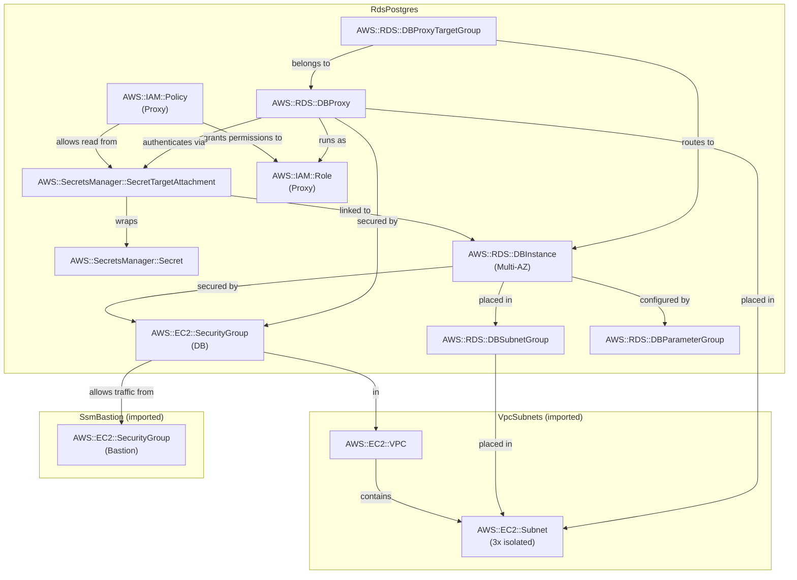

# RDS PostgreSQL — Single-AZ / Multi-AZ Standard + RDS Proxy

## Pattern Description

```
Demo Server (local)
  │  localhost:5432
  ▼
SSM Port Forwarding
  │
  ▼
EC2 Bastion (public subnet)
  │  PostgreSQL (SSL)
  ▼
RDS Proxy (isolated subnet)
  │  connection pool
  ▼
RDS PostgreSQL 17 (isolated subnet)
  ├── Single-AZ (default)   — 1 instance, no standby
  └── Multi-AZ (-c multiAz=true) — primary + hidden sync standby in second AZ
```

- [Amazon RDS for PostgreSQL](https://docs.aws.amazon.com/AmazonRDS/latest/UserGuide/CHAP_PostgreSQL.html) — managed PostgreSQL with automated patching, backups, and failover
- [RDS Proxy](https://docs.aws.amazon.com/AmazonRDS/latest/UserGuide/rds-proxy.html) — connection pooler that reduces failover time and absorbs connection spikes (e.g. Lambda)
- Single-AZ: one instance, no HA. AZ failure = downtime until restore from snapshot.
- Multi-AZ (`-c multiAz=true`): synchronous standby in a second AZ. Failover is automatic (DNS CNAME flip) in 60–120s. **The standby is invisible — it cannot serve reads.**
- Credentials auto-generated and stored in [Secrets Manager](https://docs.aws.amazon.com/secretsmanager/latest/userguide/intro.html)
- DB instance and proxy placed in **isolated subnets** (no internet route)
- VPC from [`vpc-subnets`](../../vpc-subnets/), bastion from [`ssm-bastion`](../../ssm-bastion/)

## Cost

Region: `eu-central-1`. Assumes 24/7 idle, minimal throughput.

| Resource | Idle | ~N unit/month | Cost driver |
|----------|------|--------------|-------------|
| RDS `db.t4g.micro` Single-AZ | ~$13/mo | — | Per-instance-hour billing |
| RDS `db.t4g.micro` Multi-AZ | ~$26/mo | — | 2× instance hours (standby is invisible but billed) |
| GP3 storage 20 GiB | ~$2.30/mo | — | $0.115/GiB-month |
| RDS Proxy | ~$18/mo | — | $0.015/vCPU-hour × 2 ACUs (minimum) |
| Secrets Manager | ~$0.40/mo | — | Per-secret fee |
| EC2 t4g.nano bastion | ~$3/mo | — | Instance uptime |

Dominant cost: RDS Proxy (~$18/mo) at the minimum ACU floor. Remove the proxy if your workload is not Lambda-based and you don't need fast failover.

## Notes

- **Multi-AZ standby is NOT readable.** The standby in Multi-AZ Standard accepts no connections. You pay 2× for HA only — no read scaling. Use [`rds-readable-standbys`](../rds-readable-standbys/) to get both HA and read scaling.
- **RDS Proxy reduces failover time.** Without the proxy, an application reconnects directly to the DNS endpoint, which takes 60–120s to flip. With the proxy, the proxy retries internally — the application typically sees <30s of reconnect activity.
- **Proxy requires a Secrets Manager secret.** The proxy fetches credentials from Secrets Manager at runtime. This is why `requireTLS: true` is non-negotiable — credentials travel over the proxy connection.
- **`borrowTimeout` vs `connectionTimeoutMillis`.** `borrowTimeout` is the proxy-side wait (how long the proxy waits for a free pooled connection). `connectionTimeoutMillis` in the `pg` driver is the client-side wait (how long the app waits to connect to the proxy). Both matter for tail latency.
- **t4g.micro `max_connections` ≈ 87.** The formula is `LEAST(DBInstanceClassMemory/9531392, 5000)`. For 1 GiB RAM: `1 GiB / 9531392 bytes ≈ 111`, then minus overhead ≈ 87. The proxy's 90% limit = ~78 pooled connections.

## Commands

### Deploy

```bash
# Single-AZ (cheapest, no HA)
npx cdk deploy VpcSubnets SsmBastion RdsPostgres

# Multi-AZ (automatic failover, 2× cost)
npx cdk deploy VpcSubnets SsmBastion RdsPostgres -c multiAz=true
```

### SSM Port Forwarding

```bash
# Fetch outputs
BASTION=$(aws cloudformation describe-stacks --stack-name SsmBastion \
  --query "Stacks[0].Outputs[?OutputKey=='BastionInstanceId'].OutputValue" --output text)
PROXY=$(aws cloudformation describe-stacks --stack-name RdsPostgres \
  --query "Stacks[0].Outputs[?OutputKey=='ProxyEndpoint'].OutputValue" --output text)

# Terminal 1: tunnel to RDS Proxy on local port 5432
aws ssm start-session \
  --target "$BASTION" \
  --document-name AWS-StartPortForwardingSessionToRemoteHost \
  --parameters "{\"host\":[\"$PROXY\"],\"portNumber\":[\"5432\"],\"localPortNumber\":[\"5432\"]}"
```

### Run Demo Server

```bash
AWS_REGION=eu-central-1 npx ts-node patterns/rds/demo_server.ts rds-postgres
```

### Interact

```bash
# Write a quote (RW pool -> proxy -> DB)
curl -s -X POST http://localhost:3000/quotes \
  -H "Content-Type: application/json" \
  -d '{"text":"In the beginning was the command line.","author":"Neal Stephenson"}' | jq .

# Read all quotes (RO pool -> proxy -> DB)
curl -s http://localhost:3000/quotes | jq .

# Health check (tests both pools)
curl -s http://localhost:3000/health | jq .

# Write-then-read (demonstrates that proxy has no replication lag)
curl -s http://localhost:3000/write-read-test | jq .
```

### Destroy

```bash
npx cdk destroy RdsPostgres
```

### Capture CloudFormation YAML

```bash
npx cdk synth RdsPostgres > patterns/rds/rds-postgres/cloud_formation_single_instance.yaml
npx cdk synth RdsPostgres -c multiAz=true > patterns/rds/rds-postgres/cloud_formation_multiaz.yaml
```

## Entity Relation of AWS Resources


