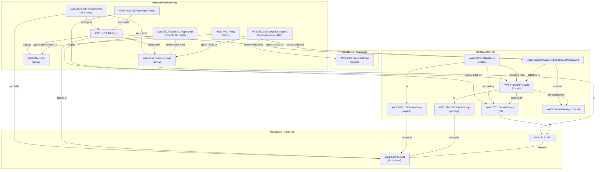

# RDS PostgreSQL — Async Read Replicas

## Pattern Description

```
Demo Server (local)
  │  localhost:5432 (RW)     localhost:5433 (RO — load-balanced)
  ▼                             ▼
SSM Port Forwarding         SSM Port Forwarding
  │                             │
  ▼                             ▼
EC2 Bastion                 EC2 Bastion
  │  PostgreSQL                 │  PostgreSQL
  ▼                             ▼
RDS Proxy (default)         RDS Proxy (read-only endpoint)
  │                             │  balances across all healthy replicas
  ▼                             ▼
RDS PostgreSQL 17           RDS Read Replica(s)
  (Primary — R/W)             (R/O — async copies)
  eu-central-1                eu-central-1
```

- [RDS Read Replicas](https://docs.aws.amazon.com/AmazonRDS/latest/UserGuide/USER_ReadRepl.html) — asynchronous copies of the primary, each with its own endpoint
- [RDS Proxy](https://docs.aws.amazon.com/AmazonRDS/latest/UserGuide/rds-proxy.html) — connection pooling and load balancing; the read-only endpoint auto-discovers replicas and distributes reads across all healthy instances
- Primary handles all writes; replica(s) offload read-heavy workloads (reporting, analytics, dashboards)
- Replication is **asynchronous** — a write on the primary may not yet be visible on the replica (eventual consistency)
- Replicas can be [promoted](https://docs.aws.amazon.com/AmazonRDS/latest/UserGuide/USER_ReadRepl.html#USER_ReadRepl.Promote) to a standalone instance for DR — this breaks replication permanently
- Credentials auto-generated and stored in [Secrets Manager](https://docs.aws.amazon.com/secretsmanager/latest/userguide/intro.html); replica inherits engine and credentials from the primary
- VPC from [`vpc-subnets`](../../vpc-subnets/), bastion from [`ssm-bastion`](../../ssm-bastion/)

## Cost

Region: `eu-central-1`. Assumes 24/7 idle, minimal throughput.

| Resource                   | Idle      | ~N unit/month | Cost driver                                |
| -------------------------- | --------- | ------------- | ------------------------------------------ |
| RDS `db.t4g.micro` primary | ~$13/mo   | —             | Per-instance-hour billing                  |
| RDS `db.t4g.micro` replica | ~$13/mo   | —             | Each replica billed as a separate instance |
| GP3 storage 20 GiB × 2     | ~$4.60/mo | —             | $0.115/GiB-month per instance              |
| RDS Proxy                  | ~$5–10/mo | —             | Per-vCPU of target instances               |
| Secrets Manager            | ~$0.40/mo | —             | Per-secret fee (primary only)              |
| EC2 t4g.nano bastion       | ~$3/mo    | —             | Instance uptime                            |

Dominant cost: DB instances (~$13/mo each). Each additional replica adds ~$13/mo. RDS Proxy adds per-vCPU cost based on the target instance sizes.

## Notes

- **Async replication means stale reads.** Under write load, the replica can lag seconds behind the primary. The `/write-read-test` endpoint demonstrates this — it writes via the primary and immediately reads via the replica, which may return `"replicated": false`. Monitor `ReplicaLag` in CloudWatch; sustained lag is a signal to scale up the replica or reduce write throughput.
- **Read replicas vs Multi-AZ — orthogonal concerns.** Multi-AZ adds a synchronous hot standby with automatic failover (~30–60 s RTO) but it cannot serve reads. Read replicas are asynchronous, serve reads, but have no automatic failover — if the primary fails you must manually promote a replica (`aws rds promote-read-replica --db-instance-identifier <id>`), which takes ~5–15 min and permanently breaks replication. Setting `multiAz: true` on the primary gives HA for writes; read replicas are orthogonal and can coexist with it.
- **Replica uses the same Secrets Manager secret as the primary.** The replica inherits credentials. Do not create a separate secret — connect with the same `username` / `password`.
- **Cross-region replicas for global DR.** Pass a VPC from a different region as `vpc` on `DatabaseInstanceReadReplica`. RDS handles cross-region replication over AWS's private backbone. Cross-region replicas have higher lag (~seconds) and additional data transfer costs.
- **Replica chaining.** RDS supports up to 15 read replicas per source. Replicas can replicate from other replicas (up to 5 hops), useful for fan-out (e.g. regional distribution, multiple analytics teams), but each hop adds replication lag.
- **Reader endpoint: RDS Proxy vs Route 53 weighted routing.** This stack uses RDS Proxy for a single load-balanced reader endpoint. An alternative is Route 53 weighted CNAME records pointing at individual replica endpoints.

  |                        | RDS Proxy (this stack)                                           | Route 53 Weighted CNAME                             |
  | ---------------------- | ---------------------------------------------------------------- | --------------------------------------------------- |
  | **Cost**               | ~$20–40/mo (per-vCPU pricing)                                    | ~$0.50/mo (hosted zone)                             |
  | **Health awareness**   | Built-in — stops routing to unhealthy replicas                   | None — needs custom Lambda health checks            |
  | **Failover**           | Automatic topology rediscovery, connection draining              | Manual record updates; DNS TTL causes stale routing |
  | **Connection pooling** | Yes — multiplexes many app connections into fewer DB connections | No                                                  |
  | **Load balancing**     | Connection-level (even distribution)                             | DNS-level (uneven with long-lived connections)      |
  | **Added latency**      | ~1–2 ms per query                                                | None                                                |
  | **Subset routing**     | No — routes to all replicas                                      | Yes — separate record names per subset              |

## Commands

### Deploy

Depends on `VpcSubnets` and `SsmBastion` stacks. Deploy both RDS stacks in order:

```bash
npx cdk deploy VpcSubnets SsmBastion RdsReadReplicas RdsReadReplicasProxy
```

### SSM Port Forwarding (two tunnels)

```bash
# Fetch outputs
BASTION=$(aws cloudformation describe-stacks --stack-name SsmBastion \
  --query "Stacks[0].Outputs[?OutputKey=='BastionInstanceId'].OutputValue" --output text)
PROXY_RW=$(aws cloudformation describe-stacks --stack-name RdsReadReplicasProxy \
  --query "Stacks[0].Outputs[?OutputKey=='ProxyReadWriteEndpoint'].OutputValue" --output text)
PROXY_RO=$(aws cloudformation describe-stacks --stack-name RdsReadReplicasProxy \
  --query "Stacks[0].Outputs[?OutputKey=='ProxyReadOnlyEndpoint'].OutputValue" --output text)

# Terminal 1: proxy default endpoint (RW → primary) on local port 5432
aws ssm start-session \
  --target "$BASTION" \
  --document-name AWS-StartPortForwardingSessionToRemoteHost \
  --parameters "{\"host\":[\"$PROXY_RW\"],\"portNumber\":[\"5432\"],\"localPortNumber\":[\"5432\"]}"

# Terminal 2: proxy read-only endpoint (RO → load-balanced replicas) on local port 5433
aws ssm start-session \
  --target "$BASTION" \
  --document-name AWS-StartPortForwardingSessionToRemoteHost \
  --parameters "{\"host\":[\"$PROXY_RO\"],\"portNumber\":[\"5432\"],\"localPortNumber\":[\"5433\"]}"
```

### Run Demo Server

```bash
AWS_REGION=eu-central-1 npx ts-node patterns/rds/demo_server.ts rds-read-replicas
```

### Interact

```bash
# Write a quote (goes to primary)
curl -s -X POST http://localhost:3000/quotes \
  -H "Content-Type: application/json" \
  -d '{"text":"All models are wrong, but some are useful.","author":"George Box"}' | jq .

# Read all quotes (goes to replica — may be slightly stale)
curl -s http://localhost:3000/quotes | jq .

# Health check (tests both pools)
curl -s http://localhost:3000/health | jq .

# Write-then-read to observe async replication lag
curl -s http://localhost:3000/write-read-test | jq .
# replicated: false means the replica hadn't caught up yet
```

### Observe Replication Lag

```bash
aws cloudwatch get-metric-statistics \
  --namespace AWS/RDS \
  --metric-name ReplicaLag \
  --dimensions Name=DBInstanceIdentifier,Value=<replica-id> \
  --start-time $(date -u -v-5M +%Y-%m-%dT%H:%M:%SZ) \
  --end-time $(date -u +%Y-%m-%dT%H:%M:%SZ) \
  --period 60 \
  --statistics Average \
  --output table
```

### Destroy

```bash
npx cdk destroy RdsReadReplicasProxy RdsReadReplicas
```

### Capture CloudFormation YAML

```bash
npx cdk synth RdsReadReplicas > patterns/rds/rds-read-replicas/cloud_formation.yaml
npx cdk synth RdsReadReplicasProxy > patterns/rds/rds-read-replicas/cloud_formation_proxy.yaml
```

## Entity Relation of AWS Resources


