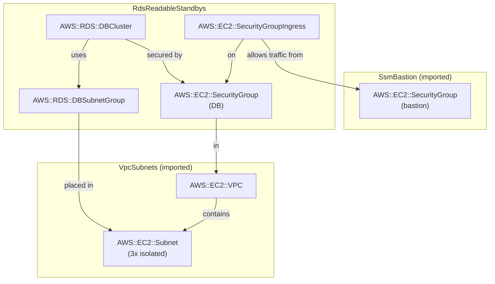

# RDS PostgreSQL — Multi-AZ DB Cluster (Readable Standbys)

## Pattern Description

```
Demo Server (local)
  │  localhost:5432 (RW)       localhost:5433 (RO)
  ▼                                ▼
SSM Port Forwarding            SSM Port Forwarding
  │                                │
  ▼                                ▼
EC2 Bastion                   EC2 Bastion
  │                                │
  ▼                                ▼
 Writer endpoint              Reader endpoint
  │                           (load-balances across standbys)
  ▼                                ▼
┌──────────────┐   ┌──────────────┐   ┌──────────────┐
│    AZ-1      │   │    AZ-2      │   │    AZ-3      │
│  ┌────────┐  │   │  ┌────────┐  │   │  ┌────────┐  │
│  │Primary │──┼──▶│  │Standby │  │   │  │Standby │  │
│  │ (R/W)  │  │   │  │ (R/O)  │  │   │  │ (R/O)  │  │
│  │        │──┼───┼──┼────────┼──┼──▶│  │        │  │
│  └────────┘  │   │  └────────┘  │   │  └────────┘  │
└──────────────┘   └──────────────┘   └──────────────┘
     (EBS)               (EBS)               (EBS)
```

- [RDS Multi-AZ DB Cluster](https://docs.aws.amazon.com/AmazonRDS/latest/UserGuide/multi-az-db-clusters-concepts.html) — 1 writer + 2 readable standbys across 3 AZs, launched in 2023
- Standbys use **semi-synchronous replication** — a write is committed after at least one standby acknowledges (quorum); the non-acknowledging standby may briefly lag, so stale reads from the reader endpoint are possible
- Both standbys serve reads via the cluster reader endpoint (load-balanced)
- Failover is automatic (<35s) — two standby candidates; no EBS reattach needed
- Credentials managed by RDS (via `manageMasterUserPassword`) and stored in [Secrets Manager](https://docs.aws.amazon.com/secretsmanager/latest/userguide/intro.html)
- VPC from [`vpc-subnets`](../../vpc-subnets/), bastion from [`ssm-bastion`](../../ssm-bastion/)

> **Cost warning**: This pattern uses `db.m5d.large` instances (the smallest supported by Multi-AZ DB clusters). At ~$38/mo each × 3 instances = ~$115/mo, plus gp3 storage (~$2/mo). Total: **~$117/mo idle**. Deploy only when you need both synchronous HA and readable standbys.

## RDS Notes

### Multi-AZ DB Cluster vs Aurora

| Feature            | RDS Multi-AZ DB Cluster        | Aurora PostgreSQL                     |
| ------------------ | ------------------------------ | ------------------------------------- |
| Readable replicas  | 2 (sync)                       | Up to 15 (zero-lag)                   |
| Failover time      | <35s                           | <30s                                  |
| Storage            | EBS per instance               | Shared distributed (6 copies × 3 AZs) |
| Storage billing    | GiB-month (gp3: IOPS included) | GiB-month + I/O requests              |
| Min instance class | `db.m5d.large`                 | `db.t4g.medium`                       |
| Idle cost          | ~$117/mo                       | ~$58/mo (writer + 1 reader)           |
| CDK construct      | L1 `CfnDBCluster`              | L2 `DatabaseCluster`                  |

Use Aurora Provisioned if you need more than 2 readers or lower idle cost at the minimum tier.

## Cost

Region: `eu-central-1`. Assumes 24/7 idle, minimal throughput.

| Resource              | Idle      | ~N unit/month | Cost driver                                      |
| --------------------- | --------- | ------------- | ------------------------------------------------ |
| 3× `db.m5d.large`     | ~$115/mo  | —             | Per-instance-hour × 3 (1 writer + 2 standbys)    |
| gp3 storage 5 GiB × 3 | ~$2/mo    | —             | $0.122/GiB-month; 3,000 IOPS + 125 MB/s included |
| Secrets Manager       | ~$0.40/mo | —             | Per-secret fee                                   |
| EC2 t4g.nano bastion  | ~$3/mo    | —             | Instance uptime                                  |

Dominant cost: the 3 `db.m5d.large` instances (~$38/mo each). No burstable instance option exists for this topology.

## Notes

- **Replication is quorum-based, not fully synchronous.** A commit requires acknowledgment from at least one of the two standbys — the other may briefly lag. The reader endpoint load-balances across both, so stale reads are possible (rare, short-lived). This is stronger than async read replicas but does not guarantee zero-lag reads.
- **Failover is faster than Multi-AZ Standard.** Multi-AZ Standard (DatabaseInstance) needs 60–120s for DNS CNAME flip + occasional EBS reattach. Multi-AZ DB clusters need <35s — two standby candidates mean one is always in a promoted-ready state.
- **The reader endpoint load-balances across both standbys.** You cannot direct specific reads to a specific standby (no per-instance endpoint). For workload isolation (e.g., OLTP reads vs analytics), consider Aurora with custom endpoints instead.

## Commands

### Deploy

Depends on `VpcSubnets` and `SsmBastion` stacks.

```bash
npx cdk deploy VpcSubnets SsmBastion RdsReadableStandbys
```

### SSM Port Forwarding (two tunnels)

```bash
# Fetch outputs
BASTION=$(aws cloudformation describe-stacks --stack-name SsmBastion \
  --query "Stacks[0].Outputs[?OutputKey=='BastionInstanceId'].OutputValue" --output text)
WRITER=$(aws cloudformation describe-stacks --stack-name RdsReadableStandbys \
  --query "Stacks[0].Outputs[?OutputKey=='WriterEndpoint'].OutputValue" --output text)
READER=$(aws cloudformation describe-stacks --stack-name RdsReadableStandbys \
  --query "Stacks[0].Outputs[?OutputKey=='ReaderEndpoint'].OutputValue" --output text)

# Terminal 1: writer (RW) on local port 5432
aws ssm start-session \
  --target "$BASTION" \
  --document-name AWS-StartPortForwardingSessionToRemoteHost \
  --parameters "{\"host\":[\"$WRITER\"],\"portNumber\":[\"5432\"],\"localPortNumber\":[\"5432\"]}"

# Terminal 2: reader (RO) on local port 5433
aws ssm start-session \
  --target "$BASTION" \
  --document-name AWS-StartPortForwardingSessionToRemoteHost \
  --parameters "{\"host\":[\"$READER\"],\"portNumber\":[\"5432\"],\"localPortNumber\":[\"5433\"]}"
```

### Run Demo Server

```bash
AWS_REGION=eu-central-1 npx ts-node patterns/rds/demo_server.ts rds-readable-standbys
```

### Interact

```bash
# Write a quote (writer endpoint)
curl -s -X POST http://localhost:3000/quotes \
  -H "Content-Type: application/json" \
  -d '{"text":"Simplicity is the ultimate sophistication.","author":"Leonardo da Vinci"}' | jq .

# Read all quotes (reader endpoint — standbys serve reads)
curl -s http://localhost:3000/quotes | jq .

# Health check (tests both writer and reader pools)
curl -s http://localhost:3000/health | jq .

# Write-then-read — always replicated=true because standbys are synchronous
curl -s http://localhost:3000/write-read-test | jq .
```

### Destroy

```bash
npx cdk destroy RdsReadableStandbys
```

### Capture CloudFormation YAML

```bash
npx cdk synth RdsReadableStandbys > patterns/rds/rds-readable-standbys/cloud_formation.yaml
```

## Entity Relation of AWS Resources


