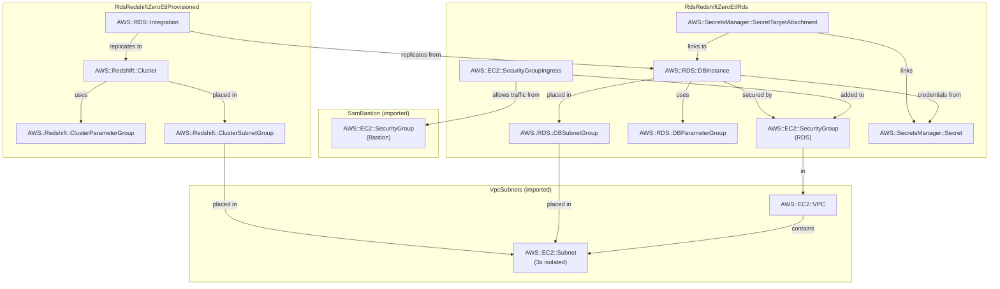

# rds-redshift-zero-etl

Continuously replicate RDS PostgreSQL databases into Redshift for analytics workload, without any ETL pipeline.
Reduce operational burden and cost of building and operating complex ETL pipelines, and so you can focus on your business logics.

```
RDS PostgreSQL 17.7              Zero-ETL               Redshift Provisioned
(db.t4g.micro, Single-AZ)   (continuous CDC)         (ra3.large, single-node)
┌──────────────────────┐    ┌──────────────┐    ┌────────────────────────────┐
│  Instance            │───▶│ CfnIntegra-  │───▶│  Cluster: zero-etl-        │
│  demo DB             │WAL │ tion (RDS)   │    │  provisioned               │
│  logical_replication │    └──────────────┘    │  case_sensitive_id = true  │
│  = 1                 │                        └────────────────────────────┘
│  replica_identity    │                                    │
│  _full = 1           │                          Redshift Data API (IAM)
└──────────────────────┘                                    │
        ▲                                                   ▼
  SSM tunnel :5432                                   Analytical queries
  (writes via pg client)                    (no load on RDS during analytics)
```

- [Amazon RDS for PostgreSQL](https://docs.aws.amazon.com/AmazonRDS/latest/UserGuide/CHAP_PostgreSQL.html) — relational source, writes via SSM tunnel
- [Amazon RDS Zero-ETL integrations](https://docs.aws.amazon.com/AmazonRDS/latest/UserGuide/zero-etl.html) — streams WAL changes to Redshift continuously
- [Amazon Redshift](https://docs.aws.amazon.com/redshift/latest/mgmt/working-with-clusters.html) — columnar data warehouse (provisioned ra3.large)
- [Redshift Data API](https://docs.aws.amazon.com/redshift/latest/mgmt/data-api.html) — query Redshift over HTTPS with IAM auth (no direct DB connection)

**Folder Structure**:

- [`stack_rds.ts`](./stack_rds.ts) — RDS PostgreSQL instance with logical replication enabled (see all [requirements](`logical_replication=1`))
- [`stack_redshift_provisioned.ts`](./stack_redshift_provisioned.ts) — Redshift Provisioned single-node cluster
- [`stack_integration.ts`](./stack_integration.ts) — the `CfnIntegration` resource linking RDS and Redshift, and a custom resource to authorize the integration
- [`demo_server.ts`](./demo_server.ts) — Express server to seed the RDS database and query Redshift via Data API
- `cloud_formation_*.yaml` — synthesized CloudFormation templates for inspection

## Cost

Region: eu-central-1. Workload: light demo writes.

| Resource                         | Idle      | ~Light usage | Cost driver    |
| -------------------------------- | --------- | ------------ | -------------- |
| RDS db.t4g.micro                 | ~$13/mo   | ~$13/mo      | Instance hours |
| RDS storage (20 GiB GP3)         | ~$2.30/mo | ~$2.30/mo    | Storage        |
| Redshift ra3.large (single-node) | ~$468/mo  | ~$468/mo     | Instance hours |
| Secrets Manager (×2)             | ~$0.80/mo | ~$0.80/mo    | Per-secret     |

**Dominant cost driver**: Redshift ra3.large at $0.649/hr. The Zero-ETL CDC stream prevents any auto-pause regardless of Redshift variant — provisioned is chosen here because it costs less than the Serverless minimum (4 RPU × $0.451/hr = $1.80/hr). dc2.large was the prior choice but is being retired by AWS and is no longer available in eu-central-1. **Run `cdk destroy` immediately after experimenting.**

## Notes

### 1. Zero-ETL Configuration Requirements

- **Mandatory RDS Parameters**: Source RDS PostgreSQL instance (v15.4+) must have `rds.logical_replication = 1` and `rds.replica_identity_full = 1`. Automated backups must be enabled.
- **Mandatory Redshift Parameter**: `enable_case_sensitive_identifier` must be `true` on the Redshift cluster/namespace. PostgreSQL identifiers are case-sensitive; without this, schema/table mapping breaks.
- **Mandatory `dataFilter`**: RDS (non-Aurora) integrations require an explicit filter (e.g., `"include: db.*.*"`) at creation.
- **Inbound Authorization**: RDS (non-Aurora) requires an explicit resource policy on the Redshift cluster authorizing the inbound integration, even for same-account setups.
- **Manual Step**: After the integration reaches `Active`, you must connect to Redshift (e.g., via Query Editor v2) to run `CREATE DATABASE demo FROM INTEGRATION '<id>'`.

### 2. Features & Behavior

- **DML Replication**: Near real-time sync for `INSERT`, `UPDATE`, and `DELETE`.
- **DDL Replication**: Supports 80+ schema changes including adding/dropping columns, adding/renaming tables, and compatible data type changes.
- See [Limitations](https://docs.aws.amazon.com/AmazonRDS/latest/UserGuide/zero-etl.html#zero-etl.reqs-lims). Highlights:
  - You can't perform a major version upgrade on the source RDS for PostgreSQL instance while it has an active zero-ETL integration.
  - Can't create a zero-ETL integration from an RDS for PostgreSQL read replica instance.
- **Latency**: Sub-minute latency is standard; typical sync occurs in under 15 seconds.
- **Read-Only Target**: Replicated tables in Redshift are read-only. Use Materialized Views or `CREATE TABLE AS SELECT` for analytical transformations.
- **History Mode** (since 02/2025): You can preserves historical changes in Redshift rather than just overwriting records. A game-changer for auditing.
- **Multiple Sources**: Up to 50 different RDS/Aurora instances into a single Redshift data warehouse to create a "data hub"
- **Automated Scaling**: If you use Redshift Serverless, the ingestion layer scales automatically to handle spikes in source database activity.

### 3. Failure Modes & Production Operations

- **Missing Primary Keys**: Tables without a `PRIMARY KEY` are silently skipped (Event `REDSHIFT-INTEGRATION-EVENT-0004`). Always define PKs on replicated tables.
- **Unsupported Data Types**: Tables containing unsupported types (e.g., certain geometry types) will fail to sync (Event `0005`). Use data filters to exclude these if necessary.
- **Resync Triggers**: Certain DDL operations, like adding a column in the middle of a table (instead of appending) or performing complex `ALTER TABLE` commands, can trigger a table resynchronization, making the table temporarily unavailable in Redshift. Data seeding from the source to the target can take 20-25 minutes, leading to increased replica lag.
- **WAL Volume Impact**: `rds.replica_identity_full = 1` writes all column values to WAL on every update, which can increase I/O on wide tables with high write rates. In production, consider setting `REPLICA IDENTITY FULL` per-table.
- **Monitoring**: using the status of integration (Creating/Active/Syncing/Needs attention/Failed), and Redshift system tables (SVV_INTEGRATION_TABLE_STATE,...)

## Commands to play with stack

**Deploy (three stacks, in order)**

```bash
cdk deploy SsmBastion RdsRedshiftZeroEtl-Rds RdsRedshiftZeroEtl-RedshiftProvisioned RdsRedshiftZeroEtl-Integration
```

**Set up SSM tunnel to RDS**

```bash
BASTION_ID=$(aws cloudformation describe-stacks --stack-name SsmBastion \
  --query 'Stacks[0].Outputs[?OutputKey==`BastionInstanceId`].OutputValue' --output text)
WRITER=$(aws cloudformation describe-stacks --stack-name RdsRedshiftZeroEtl-Rds \
  --query 'Stacks[0].Outputs[?OutputKey==`DbEndpoint`].OutputValue' --output text)

aws ssm start-session --target $BASTION_ID \
  --document-name AWS-StartPortForwardingSessionToRemoteHost \
  --parameters "host=${WRITER},portNumber=5432,localPortNumber=5432"
```

**Create Redshift database from integration** _(manual step after integration reaches Active)_

You need to connect to Redshift Query Editor v2, using 'master' user name and password from SecretManager to login.
Then run the following queries:

```sql
SELECT integration_id FROM SVV_INTEGRATION;
CREATE DATABASE demo FROM INTEGRATION '<integration-id>';
-- Wait ~1–5 min for initial table sync
SELECT * FROM demo.public.quotes LIMIT 10;
```

**Start demo server**

```bash
REDSHIFT_DB=demo AWS_REGION=eu-central-1 npx ts-node patterns/rds/rds-redshift-zero-etl/demo_server.ts
```

**Interact**

```bash
# Seed table with 5 sample quotes (creates the table too)
curl -X POST http://localhost:3000/seed

# Write a single row
curl -X POST http://localhost:3000/write \
  -H 'Content-Type: application/json' \
  -d '{"text": "Hello Zero-ETL", "author": "Demo"}'

# Read rows from RDS directly
curl http://localhost:3000/rds/rows

# List tables visible in Redshift (run after Zero-ETL sync completes)
curl http://localhost:3000/redshift/tables

# Run an analytical query against Redshift
curl -X POST http://localhost:3000/redshift/query \
  -H 'Content-Type: application/json' \
  -d '{"sql": "SELECT author, count(*) as quotes FROM public.quotes GROUP BY author ORDER BY quotes DESC"}'
# => {"id": "<statement-id>"}

# Poll the result
curl http://localhost:3000/redshift/query/<statement-id>
```

**Observe integration status**

```bash
aws rds describe-integrations \
  --query 'Integrations[?IntegrationName==`rds-to-redshift-provisioned`].[Status,Errors]' \
  --output table
```

**Destroy**

```bash
cdk destroy RdsRedshiftZeroEtl-Integration RdsRedshiftZeroEtl-RedshiftProvisioned RdsRedshiftZeroEtl-Rds SsmBastion
```

**Capture CloudFormation YAML**

```bash
cdk synth RdsRedshiftZeroEtl-Rds --output .temp > patterns/rds/rds-redshift-zero-etl/cloud_formation_rds.yaml
cdk synth RdsRedshiftZeroEtl-RedshiftProvisioned --output .temp > patterns/rds/rds-redshift-zero-etl/cloud_formation_redshift_provisioned.yaml
cdk synth RdsRedshiftZeroEtl-Integration --output .temp > patterns/rds/rds-redshift-zero-etl/cloud_formation_integration.yaml
```

## Entity Relation of AWS Resources


