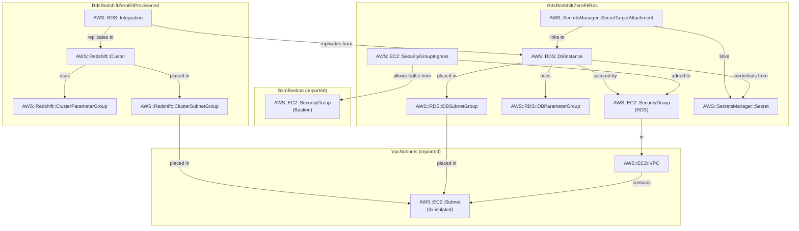

# rds-redshift-zero-etl

Continuously replicate RDS PostgreSQL data into Redshift for analytics, without any ETL pipeline.

```
RDS PostgreSQL 17.7              Zero-ETL               Redshift Provisioned
(db.t4g.micro, Single-AZ)   (continuous CDC)         (ra3.large, single-node)
┌──────────────────────┐    ┌──────────────┐    ┌────────────────────────────┐
│  Instance            │───▶│ CfnIntegra-  │───▶│  Cluster: zero-etl-        │
│  demo DB             │WAL │ tion (RDS)   │    │  provisioned               │
│  logical_replication │    └──────────────┘    │  case_sensitive_id = true  │
│  = 1                 │                        └────────────────────────────┘
│  replica_identity    │                                    │
│  _full = 1           │                          Redshift Data API (IAM)
└──────────────────────┘                                    │
        ▲                                                   ▼
  SSM tunnel :5432                                   Analytical queries
  (writes via pg client)                    (no load on RDS during analytics)
```

- [Amazon RDS for PostgreSQL](https://docs.aws.amazon.com/AmazonRDS/latest/UserGuide/CHAP_PostgreSQL.html) — relational source, writes via SSM tunnel
- [Amazon RDS Zero-ETL integrations](https://docs.aws.amazon.com/AmazonRDS/latest/UserGuide/zero-etl.html) — streams WAL changes to Redshift continuously
- [Amazon Redshift](https://docs.aws.amazon.com/redshift/latest/mgmt/working-with-clusters.html) — columnar data warehouse (provisioned ra3.large)
- [Redshift Data API](https://docs.aws.amazon.com/redshift/latest/mgmt/data-api.html) — query Redshift over HTTPS with IAM auth (no direct DB connection)

**Folder Structure**:

- [`stack_rds.ts`](./stack_rds.ts) — RDS PostgreSQL instance with logical replication enabled (see all [requirements](`logical_replication=1`))
- [`stack_redshift_provisioned.ts`](./stack_redshift_provisioned.ts) — Redshift Provisioned single-node cluster
- [`stack_integration.ts`](./stack_integration.ts) — the `CfnIntegration` resource linking RDS and Redshift, and a custom resource to authorize the integration
- [`demo_server.ts`](./demo_server.ts) — Express server to seed the RDS database and query Redshift via Data API
- `cloud_formation_*.yaml` — synthesized CloudFormation templates for inspection

## Cost

Region: eu-central-1. Workload: light demo writes.

| Resource                         | Idle      | ~Light usage | Cost driver    |
| -------------------------------- | --------- | ------------ | -------------- |
| RDS db.t4g.micro                 | ~$13/mo   | ~$13/mo      | Instance hours |
| RDS storage (20 GiB GP3)         | ~$2.30/mo | ~$2.30/mo    | Storage        |
| Redshift ra3.large (single-node) | ~$468/mo  | ~$468/mo     | Instance hours |
| Secrets Manager (×2)             | ~$0.80/mo | ~$0.80/mo    | Per-secret     |

**Dominant cost driver**: Redshift ra3.large at $0.649/hr. The Zero-ETL CDC stream prevents any auto-pause regardless of Redshift variant — provisioned is chosen here because it costs less than the Serverless minimum (4 RPU × $0.451/hr = $1.80/hr). dc2.large was the prior choice but is being retired by AWS and is no longer available in eu-central-1. **Run `cdk destroy` immediately after experimenting.**

## Notes

**Post-deploy manual step (required)** CloudFormation creates the integration but cannot create the Redshift database for you. After both stacks deploy and the integration reaches `Active` state (~10–30 min). You need to connect to Redshift Query Editor v2, using 'master' user name and password from SecretManager to login, to run the `CREATE DATABASE demo FROM INTEGRATION`.

**Failure modes and production caveats**

1. **Tables without primary keys are silently skipped.** Zero-ETL only replicates tables with a `PRIMARY KEY`. Tables without one are ignored — no error, no warning. Always define PKs on replicated tables.

2. **`enable_case_sensitive_identifier` must be `true` on the Redshift cluster.** PostgreSQL identifiers are case-sensitive; Redshift defaults to case-insensitive. Without this parameter, schema/table name mapping breaks and tables appear missing.

3. **`dataFilter` is required for RDS PostgreSQL Zero-ETL** (unlike Aurora Zero-ETL). The filter selects which databases/schemas/tables to replicate. Format: `"include: db.*.*"` or `"exclude: db.*.*, include: db.schema.table"`. Without it, CloudFormation returns a 400 error at integration creation.

4. **Integration stuck in "Creating".** Usually caused by (a) wrong parameter group (missing `rds.logical_replication=1`), or (b) automated backups disabled on the RDS instance. Check the integration status in the RDS console for the specific error. Note: unlike Aurora → Redshift, RDS (non-Aurora) → Redshift requires an explicit resource policy on the cluster authorizing the inbound integration even for same-account setups — the `RdsRedshiftZeroEtl-Integration` stack sets this via a custom resource before the integration is created.

5. **Tables enter "ResyncRequired" state** after certain DDL operations on the source: adding a column at a specific position (instead of appending), adding a `TIMESTAMP` column with `CURRENT_TIMESTAMP` default, or performing multiple column changes in a single `ALTER TABLE`. Fix: resync the affected table from the Redshift console or via `ALTER DATABASE ... INTEGRATION REFRESH TABLES ...`.

6. **Replicated tables are read-only in Redshift.** You cannot `INSERT`, `UPDATE`, `DELETE`, or `SELECT INTO` on the Zero-ETL–replicated tables. Use them as source data only; write analytical results to separate Redshift tables.

7. **`rds.replica_identity_full = 1` increases WAL volume.** This parameter writes all column values to WAL on every UPDATE/DELETE, not just changed columns or PKs. On wide tables with high write rates this can meaningfully increase I/O. For production, consider setting `REPLICA IDENTITY FULL` per-table instead of globally.

8. **Aurora-only restriction is lifted.** Standard RDS for PostgreSQL Zero-ETL became generally available in July 2025 (versions 15.11+, 16.7+, 17.3+). Earlier documentation saying "Aurora-only" is outdated.

## Commands to play with stack

**Deploy (three stacks, in order)**

```bash
cdk deploy SsmBastion RdsRedshiftZeroEtl-Rds RdsRedshiftZeroEtl-RedshiftProvisioned RdsRedshiftZeroEtl-Integration
```

**Set up SSM tunnel to RDS**

```bash
BASTION_ID=$(aws cloudformation describe-stacks --stack-name SsmBastion \
  --query 'Stacks[0].Outputs[?OutputKey==`BastionInstanceId`].OutputValue' --output text)
WRITER=$(aws cloudformation describe-stacks --stack-name RdsRedshiftZeroEtl-Rds \
  --query 'Stacks[0].Outputs[?OutputKey==`DbEndpoint`].OutputValue' --output text)

aws ssm start-session --target $BASTION_ID \
  --document-name AWS-StartPortForwardingSessionToRemoteHost \
  --parameters "host=${WRITER},portNumber=5432,localPortNumber=5432"
```

**Create Redshift database from integration** _(manual step after integration reaches Active)_

You need to connect to Redshift Query Editor v2, using 'master' user name and password from SecretManager to login.
Then run the following queries:

```sql
SELECT integration_id FROM SVV_INTEGRATION;
CREATE DATABASE demo FROM INTEGRATION '<integration-id>';
-- Wait ~1–5 min for initial table sync
SELECT * FROM demo.public.quotes LIMIT 10;
```

**Start demo server**

```bash
REDSHIFT_DB=demo AWS_REGION=eu-central-1 npx ts-node patterns/rds/rds-redshift-zero-etl/demo_server.ts
```

**Interact**

```bash
# Seed table with 5 sample quotes (creates the table too)
curl -X POST http://localhost:3000/seed

# Write a single row
curl -X POST http://localhost:3000/write \
  -H 'Content-Type: application/json' \
  -d '{"text": "Hello Zero-ETL", "author": "Demo"}'

# Read rows from RDS directly
curl http://localhost:3000/rds/rows

# List tables visible in Redshift (run after Zero-ETL sync completes)
curl http://localhost:3000/redshift/tables

# Run an analytical query against Redshift
curl -X POST http://localhost:3000/redshift/query \
  -H 'Content-Type: application/json' \
  -d '{"sql": "SELECT author, count(*) as quotes FROM public.quotes GROUP BY author ORDER BY quotes DESC"}'
# => {"id": "<statement-id>"}

# Poll the result
curl http://localhost:3000/redshift/query/<statement-id>
```

**Observe integration status**

```bash
aws rds describe-integrations \
  --query 'Integrations[?IntegrationName==`rds-to-redshift-provisioned`].[Status,Errors]' \
  --output table
```

**Check replication lag (CloudWatch)**

```bash
aws cloudwatch get-metric-statistics \
  --namespace AWS/Redshift \
  --metric-name ZeroETLIntegrationReplicationLatency \
  --period 60 \
  --start-time $(date -u -v-5M +%FT%TZ) \
  --end-time $(date -u +%FT%TZ) \
  --statistics Average \
  --output table
```

**Destroy**

```bash
cdk destroy RdsRedshiftZeroEtl-Integration RdsRedshiftZeroEtl-RedshiftProvisioned RdsRedshiftZeroEtl-Rds SsmBastion
```

**Capture CloudFormation YAML**

```bash
cdk synth RdsRedshiftZeroEtl-Rds --output .temp > patterns/rds/rds-redshift-zero-etl/cloud_formation_rds.yaml
cdk synth RdsRedshiftZeroEtl-RedshiftProvisioned --output .temp > patterns/rds/rds-redshift-zero-etl/cloud_formation_redshift_provisioned.yaml
cdk synth RdsRedshiftZeroEtl-Integration --output .temp > patterns/rds/rds-redshift-zero-etl/cloud_formation_integration.yaml
```

## Entity Relation of AWS Resources


